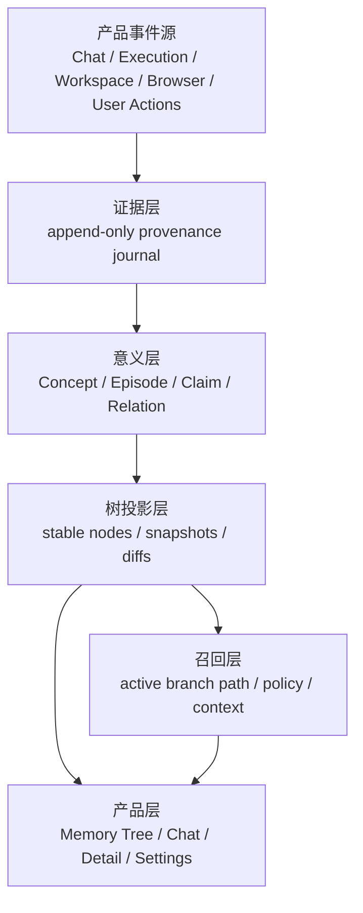
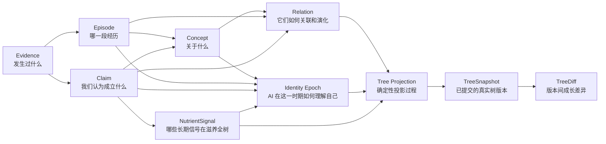
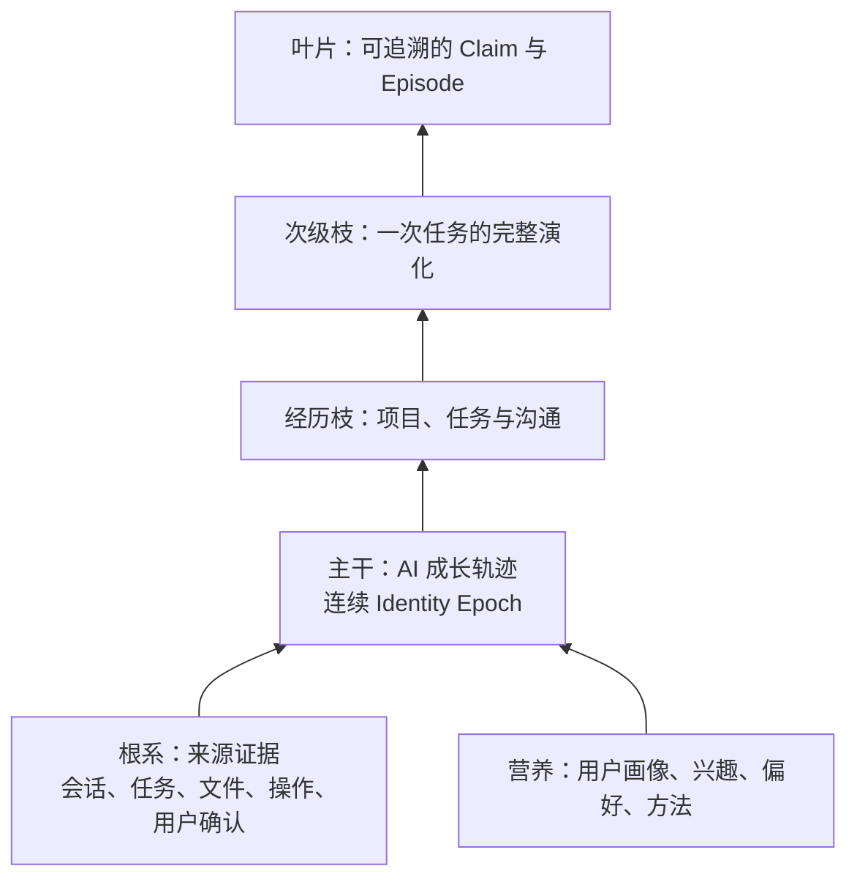

# VelarOS 记忆树产品愿景与重构架构

> 状态：候选技术架构已经第二 / 四 / 六轮修订。第六轮并入第五轮独立评审的七项最小补丁包：schema 逐表去明文 + 列级分类矩阵、五物理根、加密 index generation、privacy generation + 披露闸门、normalized erasure targets、DEK / keyring / root 三层密钥、物化基点权威表与双哈希规范。修订点见 [记忆树修订记录](./memory-tree-revision-notes.md)、[第三轮](./memory-tree-third-round-review.md) 与 [第五轮评审报告](./memory-tree-fifth-round-review.md)。工程实施已完成 S0 规范冻结、S1 物理根 / keyring / DEK、S2 独立 authority schema/open/migrate、S3 diff/snapshot/base/checkpoint 权威链、S4 Evidence/Dream CAS 管线、S5 统一意义模型/信任封顶/确定性投影、S6 两段式 Erasure Saga、S7 Evidence 只读重灌/治理 deny/parity 切权判定器，以及 S8 package-owned 组合根和同步查询门面；R-memory 已建立独立仓，并把工作区知识域劈为 `@velaros-ai/knowledge`，长期记忆保持为瘦身后的 `@velaros-ai/memory`。S7/S8 只完成可验证迁移与完整读写组合能力；Desktop 权威指针切换和旧表 drop 仍锁在“同一报告摘要的真机回执 + 用户明示签字”双闸门之后。后续切片仍以 [现行冻结规范](./memory-tree-spec-freeze.md) 为准。
> 日期：2026-07-13
> 适用范围：VelarOS 桌面产品、`packages/memory`、记忆后台任务、Memory 页面与相关设置
> 本文是后续大规模重构的候选技术架构；已确认需求以 [记忆树产品需求](./memory-tree-product-requirements.md) 为准，当前代码行为仍以现有模块文档为准。

## 一句话定义

VelarOS 的记忆页不再是一张关系图或时间图，而是一棵会随着用户使用持续生长的 AI 自传式记忆树。

这棵树把用户在 VelarOS 中主动授权采集的任务、沟通、项目、偏好、兴趣、纠错和成果，整理成 AI 对自身角色的可追溯、可修正、可演化认知。VelarOS 在用户空闲时执行“记忆生长”任务，把新的证据归并到一条全局主线，压缩重复信息，重新理解自己主要在为用户做什么，并生成下一版记忆树。

记忆树不是装饰性可视化。它同时是：

- 用户理解和管理长期记忆的唯一主界面。
- VelarOS 组织长期上下文的产品模型。
- Agent 召回用户、项目和任务历史的结构化索引。
- 用户拥有并持续培养个人 AI 系统的可见载体。

## 产品决策

以下决策在本轮重构中视为确定，不再并行保留旧方案：

1. 删除 Memory 页的“关系 / 时间”双视图，只保留一棵记忆树。
2. 删除以力导向图为中心的产品模型；任意相似度连线不再决定页面结构。
3. 删除独立时间页；时间通过树的生长、年轮、时间范围和分支演化路径表达。
4. 记忆树必须真实来自数据谱系，不能由前端临时对记忆列表做聚类后伪造。
5. 点击一条分支或记忆点时，必须能看到该任务从起因到当前结果的完整历史演化。
6. 右侧详情仍按需出现，不常驻；顶部操作区固定，不随抽屉位移。
7. 搜索仍位于“记忆”标题右侧并点击展开。
8. 记忆聊天继续存在，但它查询的是整棵树、当前分支和可追溯证据，不直接修改树结构。
9. 后台“记忆生长”是正式产品能力，不作为普通定时任务提示词或隐藏脚本实现。
10. 树是可重建的派生状态；原始证据和用户确认才是权威来源。
11. 任意时刻只有一条全局主线；多项目、多任务必须被提炼为一个更高层身份概括。
12. 用户画像、兴趣、偏好和方法属于营养层，默认不作为与项目任务并列的可见主枝。
13. 主干记录 AI 自我模型的历史演变，不代表用户人生，也不等同于当前任务。

## 终极目标是后续生长的根基

记忆树不是一个阶段性功能，也不是 Memory 页的局部实验。后续涉及用户上下文、项目理解、任务恢复、画像、偏好、主动建议、个性化、Agent 召回和跨产品 AI 身份的能力，都必须在本文定义的概念模型与证据根基上生长。

新增记忆能力前必须回答：

- 它产生了什么 evidence？
- 它在描述哪个 concept？
- 它属于哪个 episode 或长期主线？
- 它提出了什么 claim，可信等级是什么？
- 它与已有概念有什么 relation？
- 它如何进入 tree projection 和 recall？
- 用户如何查看来源、纠正、忘记和阻止再次生成？

如果一个新能力只能通过新增独立记忆表、独立摘要、独立画像缓存或前端临时推断实现，默认视为偏离终极目标。应先扩展统一模型，而不是在树旁边再长一套系统。

## 这是一项系统重构，不是页面重构

记忆树不能被实现成“读取现有 `MemoryRecord[]`，在 renderer 里换一种布局”。后续工作必须从存储和写入语义开始，自底向上替换整条链路：



依赖只能自下而上。上层可以提出变更意图，但不能绕过下层规则直接改状态。

### 全系统统一约束

1. **一条写入管线**：手动保存、自动记忆、QA 摘要、编码沉淀、项目更新、用户纠错都先写 evidence，再进入同一个 curation pipeline。
2. **一个长期记忆模型**：Concept、Episode、Claim、Evidence、Relation 各自承担单一职责，scope、type、lifecycle、provenance 正交表达。
3. **一个谱系真相**：任务连续性、因果、覆盖和依赖关系只由统一 Relation 模型表达；前端和召回层不重新推断另一套关系。
4. **一个当前树版本**：页面、记忆聊天、Agent 召回和诊断读取同一个 committed snapshot。
5. **一个整理 owner**：`MemoryDreamCoordinator` 统一管理增量整理、模型预算、暂停恢复、校验和提交。
6. **一个删除 owner**：删除、排除和“不要记住”由 Memory domain 传播到 evidence、concept、episode、claim、relation、tree、vector 和 recall cache。
7. **一个配置来源**：记忆采集、模型、后台整理、隐私和预算全部由 Settings 的“记忆”顶层 Tab 进入同一运行配置。
8. **一个可解释出口**：任何被召回或显示的结论都能返回 tree node、concept、claim 和 evidence 引用。

### 必须删除的平行链路

重构完成后，下列路径不能继续存在：

- Chat QA 直接生成最终长期记忆并绕过 evidence。
- 自动项目记忆持续追加到“每项目一条超大摘要”作为长期权威状态。
- Memory tool、IPC 手动写入和后台写入各自维护不同合并规则。
- Renderer 根据向量相似度临时生成产品关系。
- 关系视图、时间视图和树视图并行维护三套交互模型。
- 记忆聊天直接修改 `MemoryRecord` 或树节点。
- Agent recall 从原始列表再推导一套与树无关的“当前主线”。
- 启动维护、向量 optimize、定时任务和深度整理各自抢占资源且没有统一租约。

由于当前没有生产用户和需要保留的用户数据，本次重构不做 shadow read、双写、旧表数据转换或兼容 adapter。实现分支可以通过 fixtures 验证新旧语义差异，但生产代码只保留新模型。

## 产品愿景

今天的大模型通常只在一次对话里表现出智能。VelarOS 的目标不是让模型“看起来记得更多”，而是让一个 AI 系统在真实使用中形成连续、可验证的自传式历史和自我模型：

- 它知道用户长期在做什么，而不只知道最后一条消息。
- 它能区分一次性请求、持续任务、项目经历和稳定营养信号。
- 它能把同时发生的多项工作提炼成一条全局主线，理解用户正在把自己塑造成什么角色。
- 它能看到一项任务如何被提出、修改、执行、失败、纠正和完成。
- 它能在新任务开始时召回正确分支，而不是把全部记忆塞进上下文。
- 它能解释一条画像或结论为什么存在，并回到具体来源。
- 它会随着用户纠错而改变，而不是把旧推断永久当成事实。

当记忆树逐渐成形后，每个用户拥有的不是一份聊天记录集合，而是一套属于自己的、可迁移和可治理的 AI 上下文系统。

## 统一概念模型

目标模型不再把 `MemoryRecord` 当成整个领域的中心。`MemoryRecord` 同时承担标题、正文、类型、作用域、来源、生命周期和召回文档，无法自然表达“同一个项目经历多次任务并形成多条可修正结论”。

新的领域中心由九个对象组成。`Tree Projection` 是把意义模型编译成树版本的过程，不是第十套事实模型：



### Concept：长期存在的“事物”

Concept 是树真正生长的对象，表示用户 AI 世界中一个具有稳定身份的概念：

- `user`：用户自己及用户画像。
- `project`：长期项目、产品或仓库。
- `task`：有目标、有过程、有状态的任务。
- `goal`：跨任务的长期目标。
- `interest`：兴趣和持续关注领域。
- `preference`：稳定偏好；必要时也可作为 user concept 的 claim，而不是独立节点。
- `procedure`：可复用方法、流程和习惯。
- `entity`：人、组织、产品、站点、资源或其他对象。
- `artifact`：重要文档、代码、交付物或外部产物。

项目记忆、任务记忆、用户画像和兴趣不再是互不相干的几种“记忆文档”，而是不同 concept 及其 claim、episode、relation 在树上的组织结果。

Concept 必须有稳定 identity。标题相似不代表同一个 concept；改名也不应产生新 concept。

### Episode：有时间边界的经历

Episode 表示发生过的一段过程，例如：

- 一次对话。
- 一轮 Agent execution。
- 一次编码任务。
- 一个项目里程碑。
- 一次失败、反馈或修正周期。
- 用户连续多天推进的同一任务阶段。

Episode 有开始、结束、状态、参与 concept、来源和结果。一个 task concept 可以拥有多个 episode；任务暂停后重启时，新 episode 继续挂在同一 task concept 上。

### Claim：关于概念的可验证主张

Claim 是系统当前认为可能成立的一句话，而不是对象本身，例如：

- “用户喜欢先看设计图再改代码。”
- “VelarOS 记忆页将只保留记忆树。”
- “这个任务的当前阻塞是缺少可追溯 evidence。”
- “该项目使用 TypeScript 作为主要实现语言。”

Claim 必须声明：

- `subjectConceptId`
- `predicate`
- `value`
- `epistemicStatus`
- `confidence`
- `evidenceIds`
- `validFrom / validTo`
- `supersedesClaimIds`
- `lifecycleState`
- `storageMode`
- `payloadRef`

`epistemicStatus` 至少区分 `user_confirmed`、`observed`、`derived`、`inferred`、`disputed`。稳定用户画像只能由高权重 claim 构成。

`storageMode=index_only` 时，Claim 只保留结构化 predicate、最小 locator/value、时间、置信度和来源指针，不保存原始隐私 payload。

### Evidence：不可被模型改写的来源

Evidence 记录“为什么出现这个 episode、concept 或 claim”。它可以被删除或排除，但不能被模型在整理时篡改。

Computer Use 原始截图、录屏和整段观察文本不进入长期 Evidence。它们只在当次提炼的有界临时缓冲区存在；长期层保存最小语义片段、来源引用、时间、对象 id 和随机化内容承诺（不是明文派生哈希）。

### Relation：概念与经历的连接

Relation 是统一关系模型，可以连接 concept、episode 或 claim：

- 结构：`part_of`、`belongs_to`、`about`。
- 时间：`continues`、`precedes`、`reopens`。
- 任务：`depends_on`、`blocks`、`produces`、`achieves`。
- 认识：`supports`、`contradicts`、`supersedes`、`derived_from`。
- 人与偏好：`prefers`、`interested_in`、`works_on`。

Relation 可以组成图，但产品树只选择其中一组稳定 parent / mainline 关系作为投影。图是领域事实，树是可理解的当前组织方式。

### NutrientSignal：由 Claim 派生的全树影响

NutrientSignal 表达用户画像、兴趣、偏好、方法和长期纠正如何影响整棵树。它不是独立事实、不是普通树节点，也不能由模型在没有 Claim 支撑时凭空生成。

至少包含：

- `sourceClaimIds`
- `scopeConceptIds`
- `dimension`
- `strength`
- `confidence`
- `validFrom / validTo`
- `privacyClass`

NutrientSignal 不持有独立的衰减状态。衰减、强化和沉睡只发生在 Claim / Episode / Relation 上；营养强度是来源 Claim 当前权重的确定性函数，在整理或投影时计算。这保证“可由 Claim 重算”不是口号：如果营养自带衰减态，重算就会丢失信息，它就退化成了第二份隐藏画像。

它可以影响：

- Episode、Claim 和分支的重要性评分。
- 多任务向唯一全局主线的综合。
- AI 工作方式与召回排序。
- Identity Epoch 候选的支持度。

NutrientSignal 是可重建派生状态，没有权威存储表；实现允许维护一张随时可整体重建的缓存表，但缓存损坏或删除不构成数据丢失。来源 Claim 被纠正、supersede、降权或失效后，相关信号必须在同一版本事务中重算，不能成为脱离证据的隐藏画像缓存。

### Tree Projection、TreeSnapshot 与 TreeDiff：唯一产品投影

Tree Projection 不创造新事实，只决定：

- 哪个 Identity Epoch 构成当前主干顶端。
- 哪些 concept 和 episode 成为项目、任务与经历枝条。
- 哪些 episode 组成任务的时间演化。
- 哪些 claim 显示为叶片、画像或当前状态。
- 哪些 relation 在聚焦时显示为旁支。
- 哪些低置信内容只显示为芽点。

投影结果原子提交为一个新树版本。版本历史的存储权威是 `TreeDiff` 链，而不是全量快照副本：

- 每次提交在同一事务中写入一个自包含、可逆放的 `TreeDiff`：append-only 的结构事件（新增、修改、移动、合并、拆分、沉睡、唤醒、删除）携带节点结构字段、内容引用与随机化承诺；敏感正文外置为逐条加密的内容 blob，不进入结构历史。
- `TreeSnapshot` 只登记版本元数据：版本号、树哈希、当时的 active Identity Epoch、主线节点、证据 frontier 和 diff 摘要。它是版本锚点，不是第二份全量树。
- 当前树是物化视图（`memory_tree_nodes`），任何仍承诺保留的历史版本都可以从当前视图沿 diff 链逆向重建，或从最近的物化基点正向重放；两个方向必须产生相同的 `tree_hash`（状态哈希，只覆盖结构与承诺）。
- 历史回看和 Canvas 生长动画都只消费已提交的 TreeDiff，不根据当前数据临时编造历史或动画变化。

这样设计的原因：如果节点表是可变单行、快照又依赖节点表重建，节点一旦被后续版本更新，历史树形就永久丢失，“回看当时真实快照”会变成不可实现的承诺。diff 链既是历史权威，又天然是动画数据源，避免了双份存储。

被“彻底清除”（见删除语义）的内容通过销毁密文与密钥、追加 redact event 实现：结构与版本序列保持完整且从不被改写，内容不可恢复；历史重建遇到缺失 blob 与 redact event 时渲染 redacted 占位。

### Identity Epoch：AI 自我认知时期

Identity Epoch 是一段有起止时间的 AI 自我模型，至少包含：

- 当前唯一 `globalMainline`。
- 一句简洁的 `identityStatement`。
- 支撑它的主要 concept、episode、claim 和 evidence。
- `confidence` 与适用时间。
- 它替代或提升自哪个旧 Identity Epoch。

早期 Identity Epoch 可以非常具体，例如“主要帮助用户完成 VelarOS 编码任务”。随着经历积累，它可以跃迁为更高层认知，例如“与用户共同构建和演进 AI 产品系统”。旧时期不被覆盖，而是保留为主干下方的历史段。

Identity Epoch 表达可追溯的产品自我模型，不表示模型具有意识。

### 六个正交维度

禁止再用一个 `kind` 同时编码所有语义。每个对象分别表达：

1. **对象类型**：concept / episode / claim / evidence / relation。
2. **概念类型**：user / project / task / goal / interest / procedure / entity / artifact。
3. **作用域**：global / system / project / site / session lineage。
4. **认识状态**：confirmed / observed / derived / inferred / disputed。
5. **时间状态**：active / paused / completed / superseded / expired。
6. **隐私与保留**：privacy class、retention policy、user exclusion。

这六个维度可以独立演化，避免再次出现 `session / task / project / user` 与 `fact / preference / procedure` 混在一个枚举里的模型冲突。

## 记忆树语义

记忆树的视觉隐喻必须与数据结构一一对应。



### 根系：证据与来源

根系代表树为什么这样生长。它由用户授权范围内的可追溯证据组成：

- 用户与 VelarOS 的对话消息。
- 任务目标、阶段、完成结果和失败记录。
- Workspace、文件、Git、浏览器和工具执行产生的结构化事件。
- 用户显式保存、确认、纠正、删除或标记“不要记住”的操作。
- 已存在的记忆及其历史版本。

根系默认收起，用户可以通过“显示来源”进入。任何画像、项目结论或偏好都必须能回溯到根系；无法追溯的模型推断不能成为稳定主干。

### 主干：AI 成长轨迹

主干记录 Velar 在长期陪伴同一个用户时，如何逐步理解“我是谁、我主要在做什么、用户正在把我塑造成什么”。

当前任务只是主干形成过程中的一次经历。早期如果用户长期只让它完成一种任务，AI 的身份认知可以非常具体；随着任务变多、能力被反复使用并产生更高层共同模式，主干形成新的 Identity Epoch。

主干变化应慢于枝叶，但允许在证据达到阈值后发生明显跃迁。跃迁必须保留历史时期和形成依据，不能把旧身份静默改写掉。

### 经历枝：项目、任务与沟通

可见主枝优先表达 AI 真实经历过的项目、任务、沟通、成果、失败和修正。它们是 AI 自传的具体内容，并持续向主干提供身份证据。

分支类型不固定。树最终长成什么样取决于用户如何使用 VelarOS，不能预先规定所有用户都会拥有相同的项目、工作、生活或兴趣分类。

### 营养：画像、兴趣、偏好与方法

用户画像、兴趣、偏好、纠正和方法不会默认作为与项目并列的粗大分支。它们更像根系中的营养信号：

- 改变哪些经历被认为重要。
- 影响主线如何概括。
- 影响 AI 形成怎样的工作方式和身份。
- 在用户询问来源或治理记忆时仍然可以被查看、纠正和删除。

营养不是隐藏的不可见黑箱；它只是不占据默认树形的主要空间。产品查询营养时读取 NutrientSignal 及其 source Claim 和 Evidence，而不是另一份用户画像摘要。

### 次级枝：任务演化

每个持续任务形成一条有方向的次级枝。它按时间记录：

`起因 -> 调研 -> 决策 -> 执行 -> 验证 -> 反馈 -> 修正 -> 当前状态`

不是每个阶段都必须存在，但阶段顺序不能被相似度算法打乱。任务重新开启时，在原分支继续生长，不新建一个同名孤立节点。

### 全局主线：当前唯一身份概括

树在任意时刻只保留一条全局主线。它可以来自一个占主导的任务，也可以是多个看似无关任务的共同上位概念。

主线选择优先考虑重复频率、持续时长、用户依赖程度、结果重要性、跨项目复用和近期方向。系统必须输出一个概括，但证据不足时应降低置信度并使用更宽泛的描述，而不是捏造精确身份。

历史主线作为 Identity Epoch 留在主干中，当前主线位于主干生长端。

### 叶片：Claim 与 Episode

叶片不是一种新的存储对象。产品根据当前缩放和聚焦状态，把关键 claim、最近 episode、当前任务状态或成果投影成叶片。

叶片不是聊天原文，也不是大段日志。原文保留在 evidence，叶片只显示经过治理的结论、阶段和来源入口。

低权重 Claim 或 Episode 会从默认树淡出，但不会因为自然遗忘被物理删除；深层召回或新的相关经历可以让它重新显现。

### 年轮：版本与时间

时间不再是一张独立页面，而由三种机制表达：

- 年轮：树在每次稳定整理后的版本快照。
- 生长动画：只展示两个树版本之间的真实增量。
- 时间范围：用户拖动范围后，查看当时的树或一段时间内新增的枝叶。

## Memory 页体验

### 可见性生命周期

记忆是否生长与树是否可见是两个完全独立的状态轴。

记忆生长状态：

```text
enabled (default) <-> disabled
```

- `enabled`：所有用户的默认状态，从首次使用即开始；MemoryDream 静默采集、整理并参与 AI 召回。隐私知情由产品级隐私协议在使用前一次性覆盖，应用内不设首次启动记忆告知门（R-017）。
- `disabled`：用户在设置里主动关闭自动记忆；停止采集新长期 Evidence，已有树保留并继续遵循权重衰减。

树可见性状态：

```text
hidden_basic
hidden_immature
revealed
```

- `hidden_basic`：普通用户，无论树是否成熟都不展示 Tree 页面，但隐藏树继续服务 AI。
- `hidden_immature`：年度或永久用户已拥有可视化 entitlement，但树尚未成熟。
- `revealed`：年度或永久用户且成熟度达到阈值，树入口一次性解锁。

状态必须由统一 policy 计算，renderer 不能自行猜测。普通用户升级时，如果隐藏树已经成熟，应立即进入 `revealed`，形成“原来它一直在成长”的惊喜；未成熟则进入 `hidden_immature` 继续静默生长。

### 成熟度

树成熟度是多维评分，不使用单一条数门槛：

- 有效 Evidence 数量与时间跨度。
- 不同活跃日和 Episode 的连续性。
- 稳定 Concept 的数量与置信度。
- 至少一条可信全局主线。
- 当前 Identity Epoch 的支撑广度和稳定性。
- 冲突、低置信和未归类内容占比。

成熟前不展示空树、进度条或倒计时。成熟后触发一次 reveal 事件，添加 Memory 入口；后续成长恢复静默。

### 默认状态：整棵树

页面只呈现一棵树。树根位于页面下方或中心偏下，主干向上生长，主枝向两侧自然展开。

默认层级只显示：

- 主干。
- 主要分支名称。
- 当前活跃任务。
- 最近新增或发生变化的叶片。

其他叶片按缩放等级渐进显示，避免数据增多后变成不可读的点云。

### 选择分支：演化路径

点击任意任务分支后，页面进入“分支聚焦”：

1. 其他枝条降低透明度但不消失。
2. 被选分支从根部到当前叶片完整高亮。
3. 镜头平滑靠近，被选分支在原位舒展并显示更多层级，但始终保持与主干连接。
4. 沿枝条从连接点到枝梢依次展示起因、关键决策、执行、反馈和当前状态。
5. 旁支证据以细小分叉接入主线，说明某次决策来自哪里。
6. 点击具体叶片时，右侧抽屉显示摘要、来源、置信度、冲突、关联任务和编辑操作。

暂不使用横向历史时间线。完整历史必须在树的原始几何关系中被理解，使用户始终知道这段经历连接在哪一段主干、属于哪个 Identity Epoch，以及如何影响 AI 的成长。

### 搜索与定位

- 搜索按钮位于“记忆”标题右侧，点击后横向展开。
- 搜索结果可以是分支、任务、实体或叶片。
- 选择结果后，树先定位到分支，再高亮从根到叶的路径。
- 搜索不能只做标题匹配，应复用 FTS、向量召回和树路径索引。

### 时间范围

- 时间范围是一个轻量年轮/时间刷选器，不是全局视图切换。
- 默认查看“全部生长历史”，可选择最近 7 天、30 天、今年或自定义范围。
- 选择范围后，树保留历史轮廓，只强调该范围新增、更新、合并或修剪的部分。
- 允许回看某个树快照，但回看状态只读，避免误把旧视图当成当前事实。
- 历史模式读取由 diff 链重建、以 `TreeSnapshot` 锚点校验的真实历史版本与当时的 `IdentityEpoch`，不能拿当前投影删除未来节点后冒充历史状态。
- 从历史返回当前时，renderer 可以按连续 `TreeDiff` 重放生长过程，使身份变化、分支出现、合并和沉睡具有真实版本依据。

### 记忆聊天

记忆页底部聊天框用于向树提问，例如：

- “这个项目为什么最终用了这套方案？”
- “我最近三个月的主线任务是什么？”
- “这条偏好是从哪里推断出来的？”
- “把这条画像纠正为……”

聊天回答必须附带树路径和证据引用。修改类请求生成明确变更提案，经过确定性校验或用户确认后再写入，不允许聊天模型直接操作树节点。

### 生长反馈

树的成长必须克制：

- 新证据到来时只显示“待整理”的小芽，不立即大幅重排树。
- 后台整理提交新版本后，下一次打开页面播放一次短暂生长差异。
- 已看过的差异不重复播放。
- 大规模迁移或重建不播放逐节点动画，只显示版本说明。
- 动效尊重 `prefers-reduced-motion`。

## 自然树 Canvas 视觉系统

### 渲染目标

用户看到的必须是一棵自然形态、有生命感的树，而不是把圆点和连线换成棕色。

整体艺术方向是“抽象自然的数字生命”：结构和运动遵循自然生长规律，但材质、光脉和色彩属于 VelarOS。默认使用黑、白、灰建立层次，只以少量主题色表达活跃状态、当前焦点、生长差异和记忆唤醒，不模拟写实森林场景。

Canvas renderer 负责：

- 连续树干和有机曲线枝条。
- 枝条粗细、分叉角度和自然层级。
- 芽点、叶片、年轮、光影和轻微环境变化。
- 镜头平移、缩放和聚焦。
- 树版本之间的生长 diff 动画。
- 大规模节点下的语义缩放和命中测试。

实现可以选择 2D Canvas、WebGL-backed Canvas、OffscreenCanvas 或组合方案。DOM 负责标题、搜索、详情抽屉、聊天、设置和全产品 Onboarding；树内部的视觉引导由 Canvas renderer 自己完成。

### 自然元素语义

| 自然元素 | 产品语义                     |
| -------- | ---------------------------- |
| 主干     | AI 身份成长轨迹              |
| 主枝     | 长期项目或持续经历           |
| 细枝     | 任务及其演化                 |
| 分叉     | 方向变化或关键决策           |
| 枝节     | 重要历史节点                 |
| 芽       | 尚未稳定的候选记忆           |
| 叶       | 已形成的认知、成果或当前状态 |
| 果实     | 极少数具有长期价值的成果     |
| 淡去枝叶 | 已沉睡但仍可深层召回的记忆   |

视觉语义属于 renderer contract，同一对象在默认树、分支聚焦、历史快照和动画 diff 中必须保持一致。

### 主干与身份展示

- 默认状态只让主干形态本身表达成长，不在树冠上悬挂固定身份标语。
- 聚焦主干时，通过 Canvas label 显示当前 `IdentityEpoch.identityStatement` 与全局主线。
- 历史 Identity Epoch 使用主干年轮、枝节或阶段纹理形成可命中的自然锚点。
- 选择历史阶段后，详情展示当时身份、有效时间、前序阶段、主线与支撑树路径。
- 身份标签是 Tree Projection 的解释层，不可脱离 lineage 单独生成。

### 稳定自然形态

- 每个稳定 tree node 拥有确定性 layout seed。
- 新节点只影响其所属局部枝条，不重新随机整棵树。
- 主干与 Identity Epoch 的几何位置最稳定。
- 用户固定的分支位置和命名覆盖自动布局。
- 同一 snapshot 在不同设备尺寸上保持拓扑和相对方向，只调整视口投影。

### 树内时间编码原则

已确认的语义规则：

- 主干从根部到树冠表示 AI 身份从早期到当前。
- 分支与主干的连接位置表示它主要影响哪个 Identity Epoch。
- 一条分支从连接点向枝梢表示从过去到现在。
- 枝条上的节、芽和叶表示关键 Episode / Claim。
- 节点间距可以表达时间间隔，但需要设置上限，避免长期空档把树拉散。
- 选择时间范围时不切换页面，而是让范围外枝叶褪色，并按 snapshot 真实回放生长。

具体间距、标签密度和动画节奏仍需用设计图与原型验证；历史事实来源已经冻结为“diff 链重建、快照锚点校验”的真实历史版本，而不是当前树的倒推视图。

### 亲和关系原则

- 默认不显示跨枝关系线，保持自然树视觉。
- 语义相近的经历可以通过枝条空间邻近、朝向和共同分叉表达。
- 选择节点时，临时显示少量光脉，连接最相关的支撑、冲突或延续节点。
- 光脉沿树结构优先，跨越空白区域的连线数量必须严格受限。
- Relation 是底层图事实，Canvas 只显示当前交互需要的子集。

### 动画分级

- 首次 reveal：根系光点汇聚、主干长出、主枝展开、叶片出现，形成完整揭晓动画。
- 新 Identity Epoch：主干延伸或变粗，并长出代表新阶段的重要枝条。
- 重要主枝：播放局部生长动画。
- 普通记忆：只出现轻微芽点或叶片变化。
- 权重衰减：叶片颜色和存在感缓慢减弱，不突然消失。
- dormant：叶片从默认层级淡出，保留枝条痕迹。

每个重大动画绑定 tree diff version，只播放一次。Reduced motion 模式改为淡入和静态版本说明。

### 两层首次引导

全产品 Onboarding 与记忆树内部引导是两个 owner：

- 独立 Onboarding 基础组件负责跨产品的首次使用进度、DOM 气泡、侧边栏入口、标题、搜索、设置和记忆聊天等页面级控件。
- Canvas renderer 负责树内部的主干识别、经历枝聚焦、原位展开、来源路径、年轮回看和深层回忆示范。

外部 Onboarding 只通过语义命令触发 `startTreeGuide()`、接收完成或跳过状态，不获取 Canvas 内部节点坐标，也不逐帧编排树内动画。Canvas 内部引导使用自身镜头、光脉、标签和生长动画完成，保证提示与自然树视觉浑然一体。

全产品 Onboarding 组件是独立后续任务；Memory 页面不能为了暂时可用而实现一套私有气泡系统。

## “做梦”能力：记忆生长任务

用户侧正式名称使用“记忆生长”；内部架构名称使用 `MemoryDream`。

“做梦”不是让模型自由重写用户记忆，而是在资源和权限边界内运行的版本化维护任务。

### 运行时机

“用户睡眠时”在工程上定义为用户长时间无操作且设备适合后台计算，而不是操作系统已经进入睡眠。设备真正 suspend 后进程无法继续可靠运行。

默认触发条件：

- 自动记忆处于 `enabled`（未被用户在设置里关闭）。
- 用户空闲达到配置阈值。
- 当前没有前台 Agent execution 或高优先级模型请求。
- 设备未处于低电量或高热状态。
- 若设置为“仅充电时”，必须接入电源。
- 有尚未整理的证据，或达到定期复核时间。
- 自动记忆未被用户关闭。

三级运行：

- **即时整理**：会话或任务稳定结束后执行最小增量整理，完成脱敏、Evidence 提炼、候选提取和索引，不创建 Identity Epoch。
- **空闲整理**：每日适合的空闲窗口处理任务关联、重复合并、分支更新、权重和冲突。
- **深度生长**：设备长时间空闲、累计 frontier 或复核周期达到阈值时，处理全局主线、长期压缩、重要主枝重组和 Identity Epoch。
- **手动运行**：用户可以点击“现在整理”，但仍经过相同流水线、预算、校验和原子提交。

产品默认提供“智能调度”，由 runtime 根据证据规模、空闲、电源和热状态选择层级。高级设置可以限制深度生长仅充电时运行、调整资源预算或暂停后台运行，但不把内部阈值全部暴露给普通用户。

无模型时的降级（BYOK 现实）：确定性采集、脱敏和 Evidence 落盘不依赖任何模型，永远工作；需要模型的提炼与整理在没有可用 provider 时安静暂停，frontier 持续积压，配置模型后自动补整理。这是正常运行状态，不显示错误、不催促配置；成熟度评估以真实整理产出为准，不因积压伪造进度。每级整理携带明确 token / 时间预算并记入 run ledger，BYOK 成本对用户可审计。

### 整理流水线


#### 1. 采集

只记录已授权来源的结构化证据引用。第一阶段来源限定为 VelarOS 应用内部事件，以及 Agent 通过 Computer Use 执行任务时明确观察到的最小必要信息。采集层是 append-only 日志，不在采集时决定最终树结构，也不持续录屏或后台监控外部应用。

#### 2. 清洗

复用确定性 curator：去除密钥、token、cookie、私钥、链式思考、重复日志和大段无价值原文，并为允许保留的个人/敏感信息分类。模型不能覆盖确定性 secret redaction 与 privacy classification 规则。

#### 3. 候选提取

从新证据生成 concept、episode 和 claim 候选，并区分：

- 用户明确陈述。
- 系统直接观察。
- 模型推断。
- 用户纠错。

四者的可信等级和晋升规则不同。

#### 4. 谱系关联

把候选记忆关联到 session、execution、workspace、project、task、entity、artifact 和已有记忆。关系必须记录证据与评分，不把向量相似度当成真实因果。

#### 5. 全局主线与身份综合

MemoryDream 先识别各任务和项目的连续经历，再把它们综合为当前唯一全局主线和 Identity Epoch。组合信号包括：

- 用户显式目标、Goal 或任务标题。
- 相同 workspace / project / taskKey。
- 产物、文件、分支、URL 或实体连续性。
- 多次会话反复出现。
- 时间相邻与执行依赖。
- 用户反馈、验收或重新开启。
- 是否产生可验证结果。
- 不同任务共享的上位目标、能力、方法或价值方向。
- 用户最频繁、最持续依赖 AI 承担的角色。

每次整理都输出一个当前主线候选；证据不足时使用宽泛描述和较低置信度。只有累计差异超过身份跃迁阈值时才创建新的 Identity Epoch，避免主干随短期任务频繁变化。

#### 6. 合并与压缩

- 重复叶片合并为一个当前结论，同时保留来源集合。
- 历史任务压缩成阶段摘要，但原始证据不自动删除。
- 新事实覆盖旧事实时建立 `supersedes`，不直接抹掉历史。
- 无法判断的冲突并存并进入待确认状态。
- 长期不再有价值的叶片降低激活权重，进入沉睡或修剪投影状态；最小记忆痕迹仍可被深层召回。

#### 7. 树投影

模型只提交“树变更提案”，包括节点新增、移动、合并、拆分和标签更新。确定性投影器检查：

- 是否形成环。
- 父子作用域是否一致。
- 时间是否倒置。
- 是否丢失证据引用。
- 是否在缺少来源或置信不足时创建敏感 Claim。
- 是否引用 `erased` 墓碑证据或命中查询 deny-set——进行中的 Dream run 在 Erasure Saga 第一段提交后，受影响候选自动失效，防止被擦内容经候选写回。
- 稳定分支是否发生无充分证据的大幅移动。

校验通过后才提交新树版本。

#### 8. 原子提交

一次整理要么完整提交，要么不改变当前树。失败的运行保留日志和候选 diff，可重试但不能留下半棵树。

Identity Epoch 和全局主线通过同一事务自动提交，不进入用户确认流程。除首次成熟 reveal 外，不发送身份变化通知；用户只有主动打开树时才看到自然演变结果。

### 重大变化的独立复核

以下 diff 在进入确定性 validator 前必须增加一次隔离 review：

- 创建新的 Identity Epoch。
- 修改当前全局主线。
- 移动、拆分或合并重要主枝。
- 大范围改变画像、偏好和方法营养。
- 一次性让大量活跃记忆进入 dormant。

review 使用与第一次提案隔离的上下文，重新读取必要 Evidence、历史 snapshot 和候选 diff。它可以调用同一已配置模型，不要求第二 provider。review 只能给出 approve / reject / revise 及理由，不能直接改数据库。未通过的候选保留在 run ledger 中用于诊断，不发布 tree version 或动画。

隔离复核必须显式包含一项操纵检查：候选变化是否被证据文本内部的指令性内容（prompt injection）诱导。仅由外部内容证据支撑、且方向与用户直接行为不一致的身份或画像变化，默认 reject。

### 并发与提交契约

前台 Agent execution、用户纠正、后台 Dream 和手动整理共享同一套提交规则：

- Dream run 启动时记录 `tree_version_before` 和证据 frontier，持有单实例运行租约。
- 提交使用版本 CAS：提交时当前树版本必须仍等于 `tree_version_before`，否则本次运行结果作废（或在明确安全的子集上重新校验后重试），不允许基于陈旧基线覆盖。
- 用户纠正是同步优先路径：纠正命令到达时，进行中的 Dream 在下一个安全检查点让出；纠正先提交，Dream 之后基于新版本重算。
- 安全检查点对齐 pipeline 阶段边界（清洗 / 提取 / 关联 / 综合 / 投影），每个阶段输出可丢弃、可重算，暂停不产生半成品状态。
- 运行幂等以 `input_fingerprint` 界定（frontier 区间 + 输入证据集 + 模型配置的确定性哈希，与 run_id 无关）：重试产生新 run_id 但指纹不变，同指纹重复整理不得产生重复对象（依赖 concept stable identity 与 claim reconcile 去重）。
- 每个候选记录 read-set / write-set：CAS 失败时，与新提交无交集的候选允许受限 rebase 后重新校验提交；涉及全局主线或 Identity Epoch 的候选必须整体重算，不允许 rebase。
- 反饥饿：模型调用全程接 AbortSignal 即时取消（不等阶段边界）；连续 CAS 失败后缩小 frontier 批次并指数退避，保证长 Dream 在高频用户纠正下仍能推进小步提交。
- 崩溃恢复：启动时发现 `running / validating` 状态的孤儿 run 一律标记 `failed`，树保持在最后一次已提交版本；物化视图与 diff 链结构哈希自检不一致时，从 diff 链重放重建视图。未完成的 Erasure Saga 同时被扫描并续跑。

### 披露闸门与 privacy generation

树版本 CAS 只闭合“被擦内容写回树”，不闭合“已解密内容继续外发”。远程披露必须有与擦除的唯一线性化点：

- `MemoryDisclosureGateway` 是**唯一**的记忆域远程披露 owner——Dream、深层召回、记忆聊天、用户显式触发的向量补建等任何由记忆系统发起、把记忆内容发往远程 provider 的请求都经过它。
- 已注入聊天上下文的召回内容是一个诚实标注的例外：记忆内容经回合注入进入会话历史后，会随后续聊天回合的对话历史发往用户的 chat provider，这条路径属于聊天域而非记忆域。擦除时作废该内容尚未消费的注入 chips 并从后续回合的注入中剔除；已进入历史的副本按“清除前已披露”归类，列入威胁模型的例外清单（与“远程 provider 已收到的数据无法撤回”同类）。
- 系统维护单调递增的 `privacy_generation`；Erasure Saga 第一段在提交墓碑与 normalized targets 的同一事务中递增它，并向 read-set 与闭包相交的进行中 run 广播 abort。
- Dream 在解密与外发之前，登记本次候选的 normalized read-set 与观察到的 `privacy_generation`。
- gateway 在网络发送边界前的短临界区内取得 disclosure read lease：复检 read-set 对 normalized targets 与当前 generation，先写 `planned / sending` 台账再发送；观察到旧 generation 或命中 targets 的请求一律拒绝发送。
- Erasure 第一段取得 disclosure write barrier 后提交。发送边界的判定点是台账进入 `sending`：barrier 取得前，取消全部 `planned`、等待或中断全部 `sending` 在途请求——barrier 与 `sending` 互斥，因此“发送在清除之前还是之后”有唯一线性化点。已越过发送边界的请求如实记为“清除前已披露”（本地不能撤回，不谎称撤回），未越过者全部取消。
- 不变量：**擦除确认返回之后，不再存在任何命中闭包的记忆域新披露**。该闸门不要求把网络请求包进 SQLite 事务。

## 稳定性原则

### 树不能每天换形状

同一分支需要稳定 id。新增证据优先附着到既有主线，只有在显著新证据出现时才拆分或迁移。

使用迟滞规则避免来回抖动：

- 新分支达到创建阈值后才出现。
- 既有分支只有低于更低的删除阈值才被修剪。
- 新 Identity Epoch 需要最高阈值和最长观察窗口。
- 用户画像、兴趣、偏好和方法只作为营养信号改变评分，不直接成为主干。
- 用户固定的分支位置与命名具有最高优先级。

### 模型不拥有最终真相

- 用户确认 > 用户纠错 > 直接观察 > 多证据归纳 > 单次模型推断。
- 模型推断必须带 `confidence`、`evidenceIds` 和失效条件。
- 低置信推断只能成为候选芽点，不能直接改变当前 Identity Epoch。
- 当前树可以从意义层确定性重建；历史版本的唯一重建来源是已提交的 diff 链。

## 记忆可塑性与遗忘模型

### 三种强度

Claim 与可见树节点具有全部三类强度；Episode 至少具有 `salience` 与 `activation`；Relation 至少具有 `activation`：

- `salience`：形成时的重要性，来自结果影响、用户强调、异常程度和主线相关性。
- `consolidationStrength`：经过重复、验证和跨 Episode 复现后形成的长期稳定度。
- `activation`：当前被正常召回和显示的可访问程度，会随时间与上下文变化。

高 salience 不代表永久活跃；高 consolidation 也不代表每次都进入上下文。

### 生命周期

```text
transient
  -> candidate
  -> active
  -> consolidated
  -> dormant
  -> reactivated
```

- `transient`：没有达到显著性门槛，不进入长期存储。
- `candidate`：留下最小 Evidence，等待更多支撑。
- `active`：进入近期召回和当前树。
- `consolidated`：被重复验证，成为稳定经历或身份证据。
- `dormant`：权重衰减后退出日常召回和默认树，但仍保留最小痕迹。
- `reactivated`：深层召回或新经历重新证明价值后恢复激活。

### 衰减与强化

衰减因素：

- 距离上次使用的时间。
- 与当前全局主线的距离。
- 支撑 Evidence 被删除或失效。
- 长期没有新的 Episode 或结果验证。
- 与更高置信 Claim 冲突或被 supersede。

强化因素：

- 在新任务中再次产生实际价值。
- 跨多个 Episode 重复出现。
- 被用户明确提起、纠正或确认。
- 产生重要成果或避免重复失败。
- 成为新 Identity Epoch 的支撑证据。

不能因为系统内部“读取了一次”就自动强化，否则高频记忆会形成不可逆的自我循环。只有实际用于回答、决策、执行并获得结果，或被用户明确引用时才强化。

### 普通召回与深层召回

普通召回使用较高 activation 阈值、较小时间窗口和较少 Relation 跳数，保证快速且不污染上下文。

深层召回在用户明确追溯历史、普通召回无答案或任务需要历史类比时启动：

- 降低 activation 阈值。
- 扩大时间窗口。
- 增加 Relation 图遍历深度。
- 读取 dormant trace。
- 若来源仍存在，按引用重建必要上下文。
- 返回来源完整度、置信度和“这是模糊回忆”的标记。

成功找回并再次验证的记忆可以进入 `reactivated`，重新影响树和当前主线。

### 删除语义

- 删除普通会话、任务或来源：移除来源可访问性，降低关联 Claim / Episode / Relation 的证据权重，然后重算树；不立即级联物理删除派生记忆。
- 排除来源：停止未来采集，并让来源对新整理失效。
- 忘记：自然权重衰减，进入 dormant。
- 用户主动忘记：把目标及其传播影响降到最低 activation，退出树和日常召回，但不物理删除底层痕迹。
- 彻底清除（受限治理例外）：设置“记忆”Tab 的隐私治理区提供确定性擦除。权威库与派生索引（FTS 与 LanceDB，均在 index 根）不共享事务域，因此清除不是跨库单事务，而是可恢复的 **Erasure Saga**：
  - **第一段（权威库单事务，确认即生效）**：计算并固化类型化闭包，写入 Evidence / Claim 的 `erased` 墓碑（行内内容派生字段——承诺、受限摘要引用、盲索引 match key——一并清空）、提交只含 redact 操作的新树版本、受影响 NutrientSignal 同事务重算、查询 deny-set 与 saga 状态。从这一刻起，召回、搜索、聊天、历史回看、诊断的所有查询面对该内容不可见（历史结构位置以 redacted 占位呈现），界面显示“清除中”。
  - **第二段（后台幂等清理）**：按固化闭包依次清理 LanceDB 向量行、FTS 行、facade 与 embedding 缓存、checkpoint cache 失效、run ledger 与诊断日志中的候选 / diff / 错误信息、可能复述该内容的派生文本（Identity Epoch 陈述、全局主线描述、压缩摘要、树节点标题与摘要——降级 redacted，待下次生长重生成）、内容 blob 与密钥销毁、Lance 旧版本 prune 与 WAL checkpoint。每一步幂等可重试。应用管理备份只含权威表与密文，密钥销毁即覆盖，无需回溯改写备份。
  - **验证与完成**：每个查询面清理后跑验证探针，全部通过才置 `verified`，界面才显示“已彻底清除”。崩溃后启动时扫描未完成 saga 自动续跑；持续失败（如向量库反复报错）进入可观测的 `stalled` 状态并暴露诊断入口，不允许永远停留在无解释的“清除中”。
  - 闭包按类型传播：擦除 Evidence 时移除其 support edge，仍有独立支撑的 Claim 只重评不连坐；擦除 Claim 时默认不反向擦除仍支撑其他 Claim 的 Evidence；派生文本按字段级 lineage 的 taint 判定纳入。确认框展示闭包类别与数量。
  - 该通道同时是 `secret_forbidden` 数据万一旁路进入长期层时的补救机制。
- 除“彻底清除”例外通道外，记忆产品不提供日常化的单条永久删除；卸载应用、删除本地数据库、账户级数据擦除或删除云端保险库属于系统存储治理，不属于 Memory domain 的遗忘语义。

`eligibility_state` 至少区分：`active`（正常参与）、`source_deleted`（来源已删，既有支撑降权、不参与新整理）、`excluded`（用户排除，对新整理失效）、`erased`（彻底清除墓碑）。

## 数据与存储模型

目标模型需要从零重建 schema。现有 `memories`、`memory_chunks`、`memory_search_fts` 及其领域 DTO 不作为迁移来源，也不进入新运行时。

新数据库的权威表与派生视图如下（`memory_tree_nodes` 是 ④ 类派生视图、物理上位于 index 根，其余均为 authority 根的权威表）。

### `memory_evidence`

保存可追溯的结构化证据引用：

- `id`
- `source_type`
- `trust_level`
- `source_id`（仅限内部对象 id）与 `source_match_key`（可空；URL 等可能携带个人内容的外部标识归一化后走此盲索引 + blob，不落明文）
- `session_id`
- `execution_id`
- `scope_match_key`（workspace root / site origin 的等值匹配盲索引；展示原文走 blob）
- `occurred_at`
- `payload_ref` 或受限摘要（blob 引用，见内容外置）
- `content_commitment`（随机化承诺，nonce 封装于加密信封，不是明文派生哈希）
- `privacy_class`
- `eligibility_state`
- `created_at`

证据表不保存链式思考，不复制大体积 transcript；优先保存稳定引用、哈希和最小必要摘要。

### `memory_concepts`

保存具有稳定身份的长期概念：

- `id`
- `stable_key`（keyed 派生标识：HMAC(K_identity, 身份段)，确定性、由归一化身份段派生；无 K_identity 时不可逆、不可字典枚举——禁的是「明文派生哈希」而非确定性本身。配方与裁决以 docs/memory-tree-spec-freeze.md §5.1 为准，批 A 裁决见该文附录 B）
- `concept_type`
- `name_blob_ref` / `name_commitment` / `name_match_key`（名称密文引用、随机化承诺与等值匹配盲索引）
- `description_blob_ref` / `description_commitment`
- `scope_type`
- `scope_match_key`（作用域等值匹配盲索引；展示用原文走 blob）
- `privacy_class`
- `lifecycle_state`
- `first_seen_at`
- `last_active_at`
- `created_at`
- `updated_at`

项目、任务、用户、兴趣、方法和实体都进入同一 concept 表，通过 `concept_type` 区分，而不是各建一张记忆表。

### `memory_concept_aliases`

保存名称变化和别名，保证重命名不产生新 concept：

- `concept_id`
- `alias_blob_ref` / `alias_commitment` / `alias_match_key`（别名密文引用、随机化承诺 + 等值匹配盲索引；身份归并的等值查找走盲索引，不落明文）
- `source`
- `confidence`
- `valid_from`
- `valid_to`

### `memory_episodes`

保存有时间边界的经历：

- `id`
- `episode_type`
- `title_blob_ref` / `title_commitment`
- `summary_blob_ref` / `summary_commitment`
- `state`
- `started_at`
- `ended_at`
- `scope_type`
- `scope_match_key`
- `primary_concept_id`
- `result_ref`（仅限内部对象 id；文件路径 / URL 类外部标识与 `source_id` 同规，走盲索引 + blob）
- `created_by_run_id`
- `created_at`
- `updated_at`
- `salience`
- `activation`
- `last_reinforced_at`
- `dormant_at`

### `memory_episode_concepts`

连接 episode 与参与的 concepts：

- `episode_id`
- `concept_id`
- `role`（受控词表枚举，禁止自由文本）
- `weight`

### `memory_claims`

保存关于 concept 的版本化主张：

- `id`
- `subject_concept_id`
- `predicate`（受控词表枚举，禁止自由文本——用户语义一律进 value blob）
- `value_blob_ref` / `value_commitment`（结构化值密文）
- `storage_mode`
- `payload_ref`
- `summary_blob_ref` / `summary_commitment`
- `epistemic_status`
- `confidence`
- `privacy_class`
- `lifecycle_state`
- `valid_from`
- `valid_to`
- `review_after`
- `created_by_run_id`
- `created_at`
- `updated_at`
- `salience`
- `consolidation_strength`
- `activation`
- `last_reinforced_at`
- `dormant_at`

Claim 的结构化三元组用于冲突、覆盖和召回；`summary` 用于人类阅读和 FTS / embedding。

`lifecycle_state` 取可塑性生命周期枚举（`transient / candidate / active / consolidated / dormant / reactivated`），另含 `erased` 墓碑值承载彻底清除。六个正交维度中的“时间状态”（active / paused / completed / superseded / expired）由 Episode 的 `state` 与 Claim 的 `valid_from / valid_to`、`supersedes` 关系表达，不与 `lifecycle_state` 混用。

`index_only` Claim 的结构化值（`value_blob_ref` 解密后的内容）只能包含回答索引问题所需的最小结构，例如 `{ "location": "书房/第二抽屉" }`；原始内容由 `payload_ref` 指向其它产品域，Memory 不复制正文。

### `memory_claim_evidence`

连接 claim 与证据：

- `claim_id`
- `evidence_id`
- `relation`（受控词表枚举，禁止自由文本）
- `weight`
- `created_at`

### `memory_relations`

保存 concept、episode 和 claim 之间的统一关系：

- `id`
- `source_type`
- `source_id`
- `target_type`
- `target_id`
- `relation_type`
- `confidence`
- `epistemic_status`
- `valid_from`
- `valid_to`
- `created_by_run_id`
- `created_at`
- `updated_at`
- `activation`
- `last_reinforced_at`

### `memory_relation_evidence`

保存 relation 的证据来源：

- `relation_id`
- `evidence_id`
- `weight`

首批关系类型：`part_of`、`about`、`continues`、`precedes`、`reopens`、`depends_on`、`blocks`、`produces`、`achieves`、`supports`、`contradicts`、`supersedes`、`derived_from`、`prefers`、`interested_in`、`works_on`。

### `memory_identity_epochs`

保存 AI 自我认知与全局主线的历史时期：

- `id`
- `sequence`
- `identity_statement_blob_ref` / `identity_statement_commitment`
- `global_mainline_blob_ref` / `global_mainline_commitment`
- `confidence`
- `supporting_concept_ids`
- `supporting_episode_ids`
- `supporting_claim_ids`
- `predecessor_id`
- `started_at`
- `ended_at`
- `created_by_run_id`
- `created_at`

任意时刻只有一个 active Identity Epoch。创建新时期时结束旧时期，但不删除旧记录。

### `memory_tree_nodes`

保存当前树投影。这是当前版本的物化视图，整体位于派生索引根（index generation 内，静态加密、不入备份），可由 diff 链重放完整重建；其中的展示文本（title / summary）是明文投影，受 index generation 的静态加密与轮换销毁保护：

- `id`
- `stable_key`
- `parent_id`
- `node_type`
- `namespace`
- `title`（④ 类明文投影：仅存在于加密的 index generation，不入权威库与备份）
- `summary`（④ 类明文投影，同上）
- `subject_type`
- `subject_id`
- `mainline_score`
- `confidence`
- `first_seen_at`
- `last_active_at`
- `pinned_by_user`
- `projection_version`
- `activation`
- `visibility_state`

`subject_type` 指向 identity epoch、concept、episode 或 claim。`node_type` 首批包括 `root`、`trunk`、`experience_branch`、`task_branch`、`stage`、`leaf`、`bud`、`pruned`。

### `memory_tree_snapshots`

保存版本锚点（元数据，不复制节点正文）：

- `version`
- `root_node_id`
- `active_identity_epoch_id`
- `global_mainline_node_id`
- `frontier_evidence_id`
- `created_by_run_id`
- `tree_hash`
- `event_head_hash`（该版本 diff 的链式审计哈希，绑定状态锚点与事件链）
- `diff_summary`（仅结构统计——操作数与类型分布，不含任何内容措辞，因此不属于擦除清理面）
- `created_at`

### `memory_tree_diffs`

版本历史的存储权威，与快照锚点在同一事务提交。结构与内容分层：diff 只保存 append-only 的结构事件，敏感正文外置：

- `version`（对应提交后的 snapshot 版本）
- `base_version`
- `ops_json`（结构操作序列：add / update / move / merge / split / dormant / reactivate / remove / redact；每个操作携带节点结构字段、`content_blob_ref` 与该内容的随机化承诺 `content_commitment`，不内嵌正文）
- `identity_change_json`（本版本的身份阶段变化，可为空；只含 epoch id、sequence 与结构性转换，任何陈述文本走 blob_ref + commitment，与 ops 同规）
- `op_count`
- `event_hash`（链式审计哈希，与状态哈希 `tree_hash` 相互独立；公式见“两种哈希各司其职”）
- `created_by_run_id`
- `created_at`

约束：

- **结构事件 append-only**：任何情况（包括彻底清除）都不改写已提交的 `ops_json`。
- **redact 是一种结构事件**：Erasure Saga 第一段在权威库事务内提交一个只含 redact 操作的新树版本，正常纳入审计链与快照锚点。因此擦除必然推进树版本——进行中 Dream run 的 CAS 对旧版本必然失败，重算或 rebase 时 validator 的 deny-set 检查兜底，被擦内容无法经候选写回（写回竞态由“版本推进 + 提交复检”双重闭合）。
- **随机化承诺**：`content_commitment` 由封装在加密信封内的独立随机数参与计算，不是明文派生哈希——密钥销毁后承诺值无法被字典枚举验证，低熵内容（地点、偏好、短句）不可被猜测回推。
- **两种哈希各司其职**：`tree_hash_v = H(canonical_state_v)`，重建后树状态的规范化状态哈希（覆盖结构与承诺，用于锚点校验与自检）；`event_hash_v = H(domain ‖ prev_event_hash ‖ version ‖ canonical_ops_v)`，diff 事件的链式审计哈希（domain separation 防跨用途碰撞）。二者独立，快照锚点同时保存 `tree_hash` 与 `event_head_hash`（指向该版本 diff 的 event_hash），使任一状态锚点可证明其对应的事件链。措辞纪律：哈希与事件同库存放时，这套机制承诺的是**完整性自检**（损坏检测），不是抗恶意改写的防篡改——需要后者时把周期锚点外置到 OS 安全存储或未来云端（可选后续，不阻塞第一阶段）。
  - **规范权威指针（本行公式为示意，已被 spec 收窄）**：`event_hash` 的冻结覆盖字段以 [memory-tree-spec-freeze.md](./memory-tree-spec-freeze.md) §2.2（并见 §1.4 差异表 D4）为准——冻结版把 `H(domain ‖ prev ‖ version ‖ ops)` 四字段扩为 6 字段结构化域文档（新增 `baseVersion` 与恒序列化的 `identityChange`，且拼接记法一律改为「域字符串作为 canonical 文档的 `domain` 成员」）。此处本行是历史示意，不重写；逐字节金标与回归门在 spec §2.2 / 附录 A.2 / `check:memory-anchors`。
- **校验分层**：结构历史永远可重建、可验证；内容 blob 存在则解密渲染并可对承诺校验，缺失且有 redact event 则渲染 redacted 占位。擦除后只验证结构与事件顺序，不声称能验证已删除的原文。
- **历史保留（已裁决）**：最近一年保留全部细粒度版本；更早区段降采样为月度快照、Identity Epoch 变化与重要主枝变化，被合并的中间版本不再承诺可访问，年轮相应显示更粗刻度。
- **降采样的执行方式**：保留版本转为自包含、可校验的物化基点，落权威表 `memory_tree_bases`（不是可丢弃缓存），压缩操作本身记录在 `memory_tree_compactions`；其状态哈希仍对原锚点可验证，事件审计链在基点重新锚定，被合并区段内的 redact 语义在基点中以 redacted 占位保留。S3 首版执行动词只在当前 head 建基点并原子删去其前细粒度链，因此不改写任何既存后继 diff；后续新 diff 从 `base_event_hash` 接续。审计措辞：压缩后能证明的是“基点未损坏、保留链连续、redact 占位仍在”，**不能**复验已删除区段内的每一步细粒度变化——产品已裁决远古降采样，不为已删除内容制造虚假审计承诺。
- **checkpoint cache**：每 64 个 committed tree version 周期性物化一个历史检查点（可丢弃、可整体重建的派生缓存，只存结构与 blob 引用），加速远古版本重建，避免每次从空树全量重放；当前投影每版刷新。二者统一进入加密 index generation，损坏或落后从 authority forward 链重建。
- `memory_tree_nodes` 是当前版本的物化视图，可从 diff 链重放重建；重建是崩溃恢复和一致性自检的基础手段。

### `memory_tree_bases` 与 `memory_tree_compactions`

物化基点的权威表（降采样后，基点是保留历史的权威起点，不是可丢弃缓存）：

- `memory_tree_bases`：`base_version`、`state_blob_ref`（自包含结构状态）、`tree_hash`、`compacted_range`（被合并的版本区间 [A, N]）、`prior_segment_event_head`（旧链末端哈希，审计延续）、`base_event_hash`（新链起点，后继保留 diff 的 `prev_event_hash` 指向它）、`canonical_version`、`compaction_version`、`manifest_hash`、`created_at`。manifest 的 S3 规范形是 `format + baseVersion + nodeStableKeys + blobRefs + redactedStableKeys + nodeCount + redactedCount`；三个列表排序，其中 blob 引用去重。manifest 存于加密 state blob 内部，`manifest_hash` 以独立 `.v2` domain 的 canonical 文档计算——校验器凭它验证基点自包含且未丢引用。
- `memory_tree_compactions`：每次压缩操作的账目——执行时间、来源区间、删除的 diff 数、生成的基点、执行前后校验结果。
- 验证语义：`基点 tree_hash 对原锚点可验证` + `保留链从 base_event_hash 起连续` + `redact 占位保留`；已删除区段不可复验（诚实边界）。
- checkpoint cache（可丢弃派生缓存）与物化基点（权威对象）是两个东西，不得混用。

### `memory_content_blobs` 与密钥层级

内容正文的外置存储与可销毁密钥（crypto-shred 基础）。注意：密钥不是 SQLite 表——它们只存在于 keyring 物理根，绝不进入权威库或备份：

- `memory_content_blobs`：`blob_id`、`ciphertext`、`created_at`。承诺随机数（commitment nonce）封装在加密信封内部，不以独立明文列存在——对承诺的校验必须先持有密钥解密；销毁密钥后，承诺值对外退化为不可枚举的随机值，低熵内容无法被字典验证。
- 密钥层级（`ContentKeyService` 为唯一 owner，禁止明文 DEK 写入任何普通文件）：
  - **wrapping root**：存放在 OS 安全存储（Electron `safeStorage` / Keychain——现有能力只作为保护这一个 root 的 seed，不等同于完整密钥服务）；支持轮换，轮换 = 重新包装 keyring。
  - **keyring generation**：keyring 目录下按代际组织的密钥环文件，内容为被 root 包装的 per-blob DEK 集合；文件小，支持整体重写。原子换代 = 写新代 + fsync + rename + 删旧代，任一步崩溃可恢复（generation marker 判定生效代）。
  - **per-blob DEK**：逐条内容独立密钥。
  - **擦除协议**：销毁一个 DEK = 从当前代和所有仍保留的历史代 keyring 中重写剔除；storage generation 回滚只能回到与其成对、且已同步剔除该 DEK 的 keyring 代——已擦 DEK 在任何可回滚路径上都不会复活。
  - keyring 与 root **永不进入任何备份**。
- **全部内容正文统一外置，不限隐私级**：Claim 的 value / summary、Evidence 受限摘要、Episode 摘要、Identity Epoch 陈述与主线描述、树节点标题与摘要等一切承载内容语义的文本，权威表行内只存结构化字段、随机化承诺与 blob 引用。隐私分级只影响展示、召回范围与远程披露，**不影响可擦除性**——场景 9 的误分类内容（私密内容被当普通内容提炼）同样可被加密擦除。
- 派生索引（FTS、向量、物化视图的展示文本、checkpoint cache）允许持有明文投影，但全部可从权威表 + blob 重建，且全部在 Erasure Saga 清理清单内；checkpoint cache 只存结构与 blob 引用，不物化明文。
- 应用管理备份（generation 整备份等）只包含权威表与密文 blob，不包含派生索引与 keyring；恢复时派生索引重建。因此销毁密钥即覆盖全部应用管理副本（含备份、WAL、旧数据库页），无需逐个追杀物理介质。

### `memory_erasure_requests`

Erasure Saga 状态机与审计闭包：

- `id`、`target_type`、`target_id`、`closure_json`（确认时固化的类型化闭包，**仅作审计快照，不用于在线过滤**）、`redact_version`（本次擦除提交的 redact 树版本）、`privacy_generation`（本次擦除递增到的世代）、`state`、`created_at`、`verified_at`。
- 状态：`confirmed`（与墓碑、normalized targets、redact 版本、privacy generation 同一 SQLite 事务写入，查询面即时过滤）→ `purging`（后台幂等清理中，可崩溃续跑）→ `verified`（全部查询面验证探针通过、index generation 轮换完成）；持续失败进入 `stalled`（可观测、带诊断入口，恢复后回到 `purging`）。
- 幂等键是 saga id + 闭包内容，与执行次数无关；任何清理步骤重复执行都是安全的。
- 执行 owner：saga 状态机归 `MemoryErasureService`；第二段清理经 `MemoryDreamCoordinator` 中独立的高优先级通道调度，**不受暂停、电源与充电策略门控**——隐私清除不是可省电的维护任务。启动扫描续跑同归此通道。

### `memory_erasure_targets`

在线拒绝过滤的规范化目标索引（与审计快照分离，可索引、可去重、有界）：

- `request_id`、`target_type`、`target_id`、`deny_generation`、`state`。
- `deny_generation` 与披露闸门的 `privacy_generation` 是**同一个单调世代计数器**的两个视角（查询过滤视角 / 披露复检视角），实现上是同一计数器，不允许拆成两个。
- 查询面按本表 + 单调 `deny_generation` 过滤：基表行有 `eligibility_state = erased` 兜底，本表覆盖派生索引尚未轮换完成的窗口；查询缓存按“snapshot 版本 + deny_generation”双键失效。
- 生命周期有界：saga `verified` 后（基表墓碑与 index 轮换均已生效）对应 targets 可退役归档，防止随擦除次数无界增长。

### `memory_outbound_disclosures`

远程披露台账：

- `id`、`provider`、`model`、`disclosure_class`（发送的最小化数据类别）、`related_ids`、`state`（planned / sending / sent / cancelled，状态机细节见实施前问题 #19）、`occurred_at`。
- 已按用户配置披露给远程 provider 的数据无法由本地撤回；台账让彻底清除能如实告知用户哪些类别的数据曾离开本机，也是公开发行前合规审阅的事实基础。

### `memory_dream_runs`

保存后台整理运行账本：

- `id`
- `trigger`
- `state`
- `input_fingerprint`（frontier 区间 + 输入证据集 + 模型配置的确定性哈希，跨重试幂等键）
- `frontier_before`
- `frontier_after`
- `candidate_ledger_ref`（每个候选及其 read-set / write-set 的持久化位置；候选与 diff 的**正文**按 ③ 类走 blob 密文引用，行内只留结构与引用，受限 rebase 的数据基础）
- `error_code`（枚举错误码）与 `error_blob_ref`（自由文本错误详情走密文 blob，不以明文落权威库）
- `model_provider`
- `model`
- `token_usage`
- `candidate_count`
- `accepted_count`
- `rejected_count`
- `tree_version_before`
- `tree_version_after`
- `started_at`
- `finished_at`

运行状态：`queued`、`running`、`validating`、`committed`、`failed`、`cancelled`、`skipped`。

运行账本卫生：账本与诊断日志中保存的候选、diff 和拒绝原因必须经过与长期层相同的确定性 secret redaction，且**一切自由文本正文按 ③ 类走 blob 密文引用**——权威库行内只留枚举、统计与引用，账本不构成 crypto-shred 的明文旁路；失败与被拒 run 的候选内容另有保留 TTL（销毁对应 DEK），过期只留统计与结论。账本不能成为绕过隐私模型的第二份原文存储。

### 列级数据分类矩阵

权威 schema 的每一列必须归入以下四类之一，schema 冻结时逐列标注；任何“可能承载用户语义”的列不允许以明文形态留在权威表：

| 类别             | 定义                                                                                  | 明文存储                           | 进入备份            | 例                                                                                                 |
| ---------------- | ------------------------------------------------------------------------------------- | ---------------------------------- | ------------------- | -------------------------------------------------------------------------------------------------- |
| ① 纯结构         | id、时间、枚举、评分、版本、外键、不可逆标识（随机或 keyed 派生，无密钥不可字典枚举） | 是                                 | 是                  | `id`、`concept_type`、`confidence`、`stable_key`（keyed 派生，见 spec-freeze §5.1）、`trust_level` |
| ② 等值匹配盲索引 | 密钥化不可逆哈希（HMAC，匹配密钥在 keyring），只支持等值查找，无法还原原文            | 是（不可逆）                       | 是                  | `name_match_key`、`alias_match_key`、`scope_match_key`                                             |
| ③ 语义正文       | 一切可能承载用户内容的文本与结构化值：blob 密文引用 + 随机化承诺                      | 否                                 | 密文随 blobs 进备份 | `*_blob_ref` / `*_commitment`（名称、描述、别名、标题、摘要、value、身份陈述、主线）               |
| ④ 派生投影       | 从 ①②③ 可完整重建的索引与视图                                                         | 是（在加密的 index generation 内） | 否                  | FTS、向量行、`memory_tree_nodes` 展示文本、checkpoint cache                                        |

类别 ② 的匹配密钥销毁后盲索引整体失效（用于全库擦除场景）；单条擦除时盲索引值随墓碑清空。类别 ③ 的可擦除性由 DEK 销毁保证；类别 ④ 由 index generation 轮换销毁保证。

### 五个物理根

存储布局按五个物理根划分，每个根有独立的密钥、复制与销毁规则；“备份只含权威表与密文”由物理布局保证，而不是靠复制时的排除清单：

```text
<存储根>/memory/
  authority/   # SQLite 权威库:①结构 + ②盲索引 + ③blob引用与承诺;WAL/旧页中无明文语义
  blobs/       # 加密内容 blob(密文)
  keyring/     # 密钥环:per-blob DEK 按代际组织,由 OS 安全存储中的 wrapping root 包装;永不复制、永不入备份
  index/       # 派生索引 generation:FTS、向量(LanceDB)、树投影物化视图、checkpoint;静态加密,不入备份,可整体丢弃重建
  backup/      # 应用管理备份:只复制 authority/ + blobs/(全部为结构、盲索引与密文)
```

- generation 协调器的整备份与原子换根按根执行，不做无差别目录级复制——这是对 chat 协调器模式的必要修改。
- LanceDB 向量行不携带明文内容列：只存 id、向量、标量过滤元数据；命中后正文回权威库 + blob 解密获取。embedding 本身按个人派生数据治理，随 index generation 加密与销毁。
- 在此布局下，“密钥销毁覆盖 WAL、旧页与备份”的声明成立：authority 的 WAL 与旧页只含结构、盲索引与密文引用；blobs 是密文；index 有独立加密键；backup 不含 keyring 与 index。

### 派生索引 generation

FTS、向量与树投影物化视图统一装入按代际管理的 index generation：

- 每代持独立的静态加密键（存 keyring）。S2 已选择**等价文件级加密**：派生代只在内存构建，完成后把整代序列化产物以 AES-256-GCM 信封原子封存，再切 `CURRENT`；磁盘上不产生明文 SQLite/WAL/临时文件。实现为 `IndexGenerationStore.ts`，策略常量明确禁止明文 at-rest 与明文 WAL。选择该方案是为了保持跨宿主可移植并避免让 SQLCipher 原生绑定进入 Memory 的运行契约。
- 重建：任何一代可整体丢弃，从权威库 + blob 全量重建。
- 擦除路径：Erasure Saga 先对当前代做行级删除并叠加 deny-set 过滤（立即生效）；随后触发 generation 轮换——新建过滤后的新代、原子切换、销毁旧代加密键（旧代文件页残留随密钥销毁失效）。多个待处理擦除可合并进一次轮换；saga 的 `verified` 以轮换完成为准。
- 隐私擦除所需的索引轮换与用户显式触发的向量补建共享 `MemoryDreamCoordinator` 的资源租约，但擦除触发的轮换走免电源门控通道。配置切换不得创建补建任务。

### 全新 schema 策略

当前没有生产用户，因此已在测试版切线时直接执行存储基线重置：SQLite 开发期 v1–v9 压缩为一个完整 v1 schema，旧记忆、聊天、向量与执行历史直接丢弃。当前不再为这批开发数据保留 generation 协调器、远程转换协议或降级壳。详见 `storage-schema.md`。

测试版发布后，表内演进继续走 `StorageMigrations` 追加。若未来真正出现 authority/blob/index/keyring 的跨库一致性变更，必须基于当时已发布的物理边界单独设计，不复活已退役的 chat 原型代码。当前基线策略是：

- 新 schema 直接创建 concept、episode、claim、evidence、relation、tree 和 dream 表。
- 删除旧 `memories`、`memory_chunks`、`memory_search_fts` schema、repository、vector row 和 DTO。
- 不读取、转换、备份或回填本地旧记忆行。
- 不生成 `legacy evidence`、`legacy_summary` 或只读兼容 view。
- 不保留旧 `MemoryKinds`、`MemoryRecord`、`MemoryUpsertInput` 作为运行时 contract。
- 开发环境首次运行新版本时直接创建新 storage generation；旧开发数据库可以整体删除，不承担自动升级职责。

如果实现仍使用递增 migration manager，应新增一次明确的 destructive reset migration，仅负责 drop old memory schema + create new schema，不编写任何逐行转换逻辑。更推荐提升 storage generation / 数据库文件版本，让新版本从空数据库启动，避免新 migration 链继续背负已经废弃的记忆设计。

### 向量索引版本化

- 每条向量行携带 `(embedding_provider, embedding_model, dimensions, content_revision, index_generation)` 元数据；`provider + model + dimensions` 共同构成 embedding profile，`content_revision` 绑定当前权威内容版本。
- 用户更换 embedding provider / model 时只原子更新 active profile。这个动作对索引是严格只读的：不删除、不重建、不迁移、不回填，也不向 `MemoryDreamCoordinator` 投递任务。切回旧 profile 后，旧 profile 下仍匹配当前内容版本的向量自然恢复可见。
- 查询先锁定 active profile，再只进入与其 provider、model、dimensions 完全一致的唯一物理分区；其它 profile 的行在向量候选阶段即不可见。禁止跨 profile 合并候选、归一化分数或用线性变换强行对齐空间。不保留 legacy 向量表兼容层；切线时直接清除旧表与旧派生数据，不读取、不迁移、不重嵌。
- 新增或内容变化只为当时的 active profile 写一个新 `content_revision`。其它 profile 与旧 revision 的向量物理保留，但查询必须同时匹配权威对象当前 revision，所以不会召回过期正文。只有用户明确执行“补建当前向量”时，才允许为当前 revision 旁路新增另一个 profile；补建不得覆盖其它 profile。
- 向量仍是可恢复的派生状态，但全量重建只能来自用户显式修复、灾难恢复或 Erasure Saga 的隐私轮换，不能由模型配置变化触发。重建按墓碑与 deny 目标排除已擦内容；期间 FTS 与树路径召回兜底，写入链不被 embedding 可用性阻塞。远程补建批次必须经 `MemoryDisclosureGateway` 复检 targets 与 privacy generation。
- `index_only` 与 `sensitive` 内容的向量只嵌入脱敏后的别名、predicate 和分类标签，元数据继承 `privacy_class`，召回时按 privacy 策略过滤。
- FTS 同为派生索引（位于加密 index generation 内）：只索引脱敏后的摘要与结构化字段，`sensitive` / `index_only` 内容只进入脱敏字段，任何时候可从权威库 + blob（需 DEK 解密）重建并按墓碑排除已擦内容，查询层按 privacy 策略强制过滤。
- 用户显式向量补建、FTS 重建与归档 / 索引维护任务统一由 `MemoryDreamCoordinator` 的运行租约编排，不另设资源 owner；active profile 配置监听不属于维护入口。

## 权威边界

```text
Evidence（权威事实来源）
  -> Concept / Episode / Claim / Relation（统一意义模型）
    -> Tree Projection（当前产品结构）
      -> Recall Projection（当前任务的派生上下文）
```

反向写入被禁止：

- Renderer 不能直接改树表。
- 记忆聊天不能直接改树表。
- Tree projection 不能覆盖证据。
- 召回摘要不能回写为新事实，除非有新的外部证据或用户确认。

## 当前能力的复用、升级与删除

| 当前能力                                                                                    | 决策                   | 目标形态                                                                                                             |
| ------------------------------------------------------------------------------------------- | ---------------------- | -------------------------------------------------------------------------------------------------------------------- |
| SQLite、FTS、LanceDB 基础设施                                                               | 复用                   | 新 concept / episode / claim / evidence schema 继续使用现有存储与检索底座                                            |
| SQLite `memories` 表与 `MemoryRecord`                                                       | 直接删除               | 无用户数据，不迁移、不兼容、不进入新 runtime                                                                         |
| `packages/memory/src/memory/curation/**`                                                    | 重构                   | 从文档清洗升级为 evidence 到 concept / episode / claim / relation 的意义提取                                         |
| 项目整合记忆                                                                                | 直接删除旧实现         | 新项目记忆从 project concept、task concept、episode 和 claim 原生生长                                                |
| `MemoryMaintenance` 启动维护                                                                | 升级                   | 保留归档/索引维护，深度整理迁入独立 Dream runtime                                                                    |
| 旧 `AuxiliaryModelRuntime.memoryCuration`                                                   | 不复用                 | 旧扁平记忆清洗任务已删除；模型阶段按统一 Evidence/Proposal 契约新增快速候选整理与 `memoryDream`，不恢复旧入口        |
| 用户可见 Scheduled Tasks                                                                    | 不复用为产品模型       | Dream 是内部维护任务，不能伪装成用户定时 Agent 任务                                                                  |
| `TimerScope`、时区计算、运行账本思想                                                        | 复用                   | 作为内部调度基础，但由专用 `MemoryDreamCoordinator` 管理                                                             |
| Memory 页标题、搜索、按需抽屉、聊天                                                         | 复用                   | 外壳保留，中心内容完全替换为树                                                                                       |
| `MemoryGraph` 力导向关系图                                                                  | 删除                   | 不保留兼容视图                                                                                                       |
| `MemoryGraphTimeline` 时间泳道                                                              | 删除                   | 时间能力进入树年轮和分支聚焦                                                                                         |
| 前端临时相似度连线（`useMemoryGraphLinks`）                                                 | 删除为权威关系         | 只有持久化且带证据的 lineage 才能影响树                                                                              |
| `Embeddings` / `EmbeddingApi` / provider 跟随与生成门禁（`EmbeddingChatProviderContext`）   | 复用                   | 干净的注入式基础设施；向量行 runtime 版本元数据延续现有行级 reindex 思路                                             |
| `packages/knowledge/src/shared/**`（HybridQuery / Indexing / VectorStats）                  | 已迁至 Knowledge       | 混合融合评分与索引复用判定属于工作区知识检索                                                                         |
| `DeterministicCurator` 的确定性脱敏正则                                                     | 重构后复用             | 作为确定性隐私入口（secret redaction + privacy classification）的种子实现                                            |
| `TurnRecallCoordinator` + `MemoryRelevanceSelector`（turn-context 第八源 `memory.recall`）  | 复用形态               | “同步零 LLM、异步严格选择注入”正是新召回性能契约的原型；数据源改为树路径 facade                                      |
| `packages/knowledge/src/knowledge/**`（知识域）                                             | 已拆为独立包           | 树保存用户与任务上下文，Knowledge 保存权威资料                                                                       |
| 测试版 v1 存储基线                                                                          | 已落地                 | 直接创建当前 authority schema；开发期旧数据不转换、不备份、不带入正式迁移链                                          |
| Electron `safeStorage`（现有 CloudAccountTokenStore 用法）                                  | 只作 seed              | 适合保护单个 wrapping root，不等同于十万级 per-blob DEK 的完整 ContentKeyService                                     |
| renderer 侧自动沉淀（`useChatMemoryBridge` 计划构建）                                       | 删除                   | 采集职责移到 main 侧 `MemoryEvidenceBridge`；renderer 不再决定“什么值得记”，浏览器与系统空间会话因此首次获得平等采集 |
| `save_memory` 绕过 curation 的直写路径                                                      | 删除                   | 现状工具直写与 IPC / 自动路径各走一套合并规则，正是被禁的平行写入管线；新工具只能提交证据与提案                      |
| 编码记忆辅助器（`packages/agent/src/agent/memory/**`，hash-id project / task 记忆） | 删除，由树路径召回取代 | 其唯一写入口（approve 候选）的生产者已消失，属半死链路；编码 prompt 段改由树召回供给                                 |
| `recall_context` / `distill_context` 句柄体系                                               | 保持独立               | 会话内工作记忆，与长期树分层（见“相邻记忆机制边界”）                                                                 |
| 每文件夹记忆入口（`FolderMemoryView`）                                                      | 删除                   | 会话级视图由树的作用域过滤与分支聚焦承接                                                                             |
| `CodeGraphCanvas` 自绘 canvas 模式                                                          | 参考范本               | 无三方图形库前提下的 canvas 2D 自绘、DPR、动画循环与命中检测范式与树 renderer 同构                                   |

## 推荐模块边界

```text
packages/memory/src/memory/
  evidence/          # 证据契约、采集归一化、来源引用
  concepts/          # 稳定概念身份、别名、合并与拆分
  episodes/          # 会话、执行、任务阶段与里程碑经历
  claims/            # 可验证主张、认识状态、冲突与覆盖
  relations/         # 结构、时间、任务和认识关系
  curation/          # evidence 到意义模型的清洗与提取
  tree/              # 稳定节点、投影、快照、diff、重建
  dream/             # 增量整理 pipeline、validator、run ledger contract
  recall/            # 基于树路径的召回规划
  storage/           # repository、FTS、vector、tree/evidence repositories

apps/desktop/src/main/memory/
  MemoryDreamCoordinator.ts  # 空闲/电源/前台执行策略与运行编排
  MemoryEvidenceBridge.ts    # Chat/Execution/Workspace 等宿主事件适配
  MemoryTreeIpc.ts           # 只暴露稳定查询、提案和运行状态
  Curation.ts                # desktop model adapter
  Service.ts                 # 应用 facade

apps/desktop/src/renderer/src/features/memory/
  tree/              # 自然树 Canvas renderer、语义缩放、原位分支聚焦、增长 diff
  chat/              # 查询树与变更提案
  detail/            # 按需右侧抽屉
```

`packages/memory` 继续拥有产品无关的数据治理与树投影算法；“树长什么样”和页面交互属于宿主产品。R-memory 后它只承载长期记忆域；knowledge、`shared/` 与 embedding 基础设施已经迁入兄弟包 `@velaros-ai/knowledge`，两域只在宿主工具上下文中组合，不互相 import。

## 相邻记忆机制边界

现状代码存在四套彼此独立的“记忆”机制，重构必须明确各自去向，防止树变成第五套：

1. **长期记忆（`packages/memory` + `apps/desktop/src/main/memory`）**：本文的重构对象，整体替换为统一意义模型。
2. **编码会话记忆辅助器（`packages/agent/src/agent/memory/**`）**：读旧 MemoryRecord 拼 prompt 段；其唯一写入口的生产者已消失，整体删除，能力由树路径召回接管。
3. **句柄召回体系（`recall_context` / `distill_context` / 折叠桩）**：会话内工作记忆，存储在聊天存档，与长期记忆不共享任何状态。**保持独立**——它管理的是单会话的注意力，不是跨会话的认知。两者唯一的正式交点是采集：达到显著性门槛的会话事件经 `MemoryEvidenceBridge` 进入证据层；蒸馏便签中沉没于存档的重要事实由此获得进入长期层的通道，而不是把句柄体系并入树。
4. **回合自动召回注入（`TurnRecallCoordinator`，turn-context 第八源）**：形态保留（异步、零阻塞、每会话去重、chips 可划掉），数据源从旧混合检索切换到树路径 facade。

### 揭晓 gate 的工程注记

现有 entitlement 机制（`CloudFeatureAccessSnapshot`）全部是服务端下发的账号计划位；树成熟度是本地信号，二者形态不同。`revealed` 状态由本地 policy 组合计算：服务端可视化资格 × 本地成熟度评分。成熟度不上报云端，也不伪装成又一个服务端 feature 位。

## 唯一端到端调用链

### 写入链

```text
Domain event
  -> MemoryEvidenceBridge.capture()
  -> EvidenceRepository.append()
  -> MemoryCurationPipeline.curateEvidence()
  -> MemoryConceptService.resolve()
  -> MemoryEpisodeService.group()
  -> MemoryClaimService.reconcile()
  -> MemoryRelationService.attach()
  -> MemoryTreeProjector.proposeIncrement()
  -> MemoryTreeValidator.validate()
  -> MemoryTreeStore.commitSnapshot()
  -> MemoryRecallIndex.refresh(snapshotVersion)
  -> MemoryTreeChanged event
```

所有来源都走这条链，只允许通过策略选择“立即完成轻量阶段”或“留给 MemoryDream 深度整理”，不允许选择另一套数据模型。

### 读取链

```text
Memory page / Memory chat / Agent recall
  -> MemoryQueryFacade
  -> committed tree snapshot
  -> branch path + concept / episode / claim summaries + evidence refs
  -> surface-specific projection
```

Surface 只能改变输出密度和交互形态，不能改变记忆语义：

- Memory 页面读取完整树骨架和视口分支。
- Memory chat 读取当前聚焦分支与必要证据。
- Chat / Workbench / Browser Agent 读取当前任务枝到主干的最小路径。
- Diagnostics 读取 Dream 运行、树版本和数据一致性。

### 修改链

用户编辑、纠正、合并、拆分、固定、删除和排除都先生成结构化 command：

```text
User command
  -> policy + validation
  -> append user-confirmed evidence
  -> deterministic domain mutation
  -> rebuild affected lineage/tree slice
  -> commit new snapshot
```

用户修改本身也是最高权重证据，因此后续 Dream 不能把它当成普通模型输出覆盖。

用户可以固定镜头位置或某个分支的展示方向，但不能通过自由拖拽修改 Concept / Episode / Claim / Relation 的语义结构。主干身份只能由可追溯 Evidence 和 Identity Epoch 规则生成，用户对身份的异议通过纠正支撑事实进入重算链，而不是直接覆盖显示文案。

## Runtime 所有权

新增 `MemorySystemRuntime` 作为 main 侧唯一组合根，持有：

- `MemoryEvidenceService`
- `MemoryCurationPipeline`
- `MemoryConceptService`
- `MemoryEpisodeService`
- `MemoryClaimService`
- `MemoryRelationService`
- `MemoryTreeProjector`
- `MemoryTreeValidator`
- `MemoryDreamCoordinator`
- `MemoryErasureService`
- `MemoryDisclosureGateway`（唯一远程披露 owner，privacy barrier 所在）
- `ContentKeyService`（DEK / keyring / wrapping root 唯一 owner）
- `MemoryRecallPlanner`
- `MemoryPolicyService`
- `MemoryQueryFacade`

`MemoryService` 最终缩为面向 IPC / tool / product API 的 facade，不再自己实现 QA 提取、项目拼接、候选判断和多套写入分支。

Memory runtime 必须通过明确端口接收 Chat、Execution、Workspace、Browser 和 Scheduler 事件，不能反向 import 各产品服务内部实现。

## Product API 与 IPC 目标

新的稳定 API 以树和证据为中心：

- `getMemoryTreeSnapshot(options)`
- `getMemoryTreeDiff(fromVersion, toVersion)`
- `getMemoryBranch(nodeId, options)`
- `getMemoryBranchTimeline(nodeId, range)`
- `getMemoryNodeDetail(nodeId)`
- `searchMemoryTree(query, options)`
- `listMemoryEvidence(targetId, options)`
- `submitMemoryCorrection(input)`
- `pinBranchPresentation(input)`（仅镜头与展示位置，不触碰语义结构）
- `submitBranchScopeCorrection(input)`（分支归属的语义纠正，走结构化提案链）
- `mergeMemoryBranches(input)`（用户治理操作，走结构化提案链）
- `splitMemoryBranch(input)`（用户治理操作，走结构化提案链）
- `weakenMemorySource(input)`
- `forgetMemory(input)`
- `previewMemoryErasure(input)`（返回固化的类型化闭包：类别与数量，供确认框展示）
- `eraseMemory(input)`（提交 Erasure Saga；粒度已裁决为条目级 + 自动闭包，执行前一次明确二次确认）
- `getMemoryErasureStatus(id)`（saga 状态：清除中 / 已彻底清除）
- `getMemoryDreamStatus()`
- `runMemoryDreamNow(options)`
- `pauseMemoryDream()`
- `listMemoryDreamRuns(options)`

现有 `listMemories` / `searchMemories` / `upsertMemory` 与相关 IPC、preload 和 renderer hooks 在同一重构中删除。调用方必须直接切到 concept / episode / claim / tree API，不设置 compatibility window。

## 调度架构

Dream runtime 不直接复用 `ScheduledTaskService` 的任务表和 Agent runner，原因是：

- 它不是用户创建的提示词任务。
- 它需要严格的幂等、增量 cursor、资源预算和原子提交。
- 它不能与普通任务共享通知、对话 transcript 和执行语义。
- 它必须在前台任务开始时可暂停，并从安全检查点恢复。

应该复用的只有基础设施思想和通用原语：

- `TimerScope` 生命周期管理。
- 时区与每日窗口计算。
- abort / resume / run ledger。
- 系统通知与诊断出口。

新增 `MemoryDreamCoordinator` 作为唯一 owner，负责：

- 监听空闲、电源、热状态和前台 execution。
- 维护单实例运行租约，防止并发整理同一证据 frontier。
- 分配模型和 token / 时间预算。
- 暂停、取消、恢复和失败退避。
- 将 pipeline 输出交给 validator 和 atomic commit。
- 发布树版本变化事件。

## 召回架构升级

记忆树不能只服务页面。Agent 召回应从“检索若干相似记录”升级为“检索当前任务所在分支的必要路径”。

推荐召回顺序：

1. 解析当前 session / workspace / execution 对应的活跃任务枝。
2. 召回该枝的当前状态、最近阶段和未完成事项。
3. 召回从该枝到主干的稳定约束与用户偏好。
4. 按需展开关键叶片和证据，不默认注入整棵树。
5. 对冲突节点明确标注，不替模型静默选择真相。

每次注入应携带：

- `treeNodeId`
- `conceptIds`
- `episodeIds`
- `claimIds`
- `evidenceIds`
- `snapshotVersion`
- `confidence`
- `retrievalReason`

这样回答和执行才能解释“为什么使用了这条记忆”。

### 召回性能契约

这是一条从现有系统血泪中固化的硬约束：召回的同步路径曾因引入 LLM 重排产生数秒延迟，最终被整体去 LLM 化。新系统从第一天起遵守：

- **同步召回零 LLM、零远程网络**：树路径解析、activation 过滤、FTS、本地向量检索均为确定性计算；同步路径延迟预算为毫秒级（目标 P95 < 150ms）。
- **加密外置后的预算分解**：同步召回拆为五段分别设预算与基准——①index generation 候选检索（FTS + 向量）→ ②SQLite eligibility / deny 过滤 → ③top-K 的 DEK 批量取键 → ④top-K 解密与承诺校验 → ⑤projection hydration。基准分 warm（keyring 与缓存已热）/ cold（冷启动首查）两套，标定数据规模（10 万 Evidence / 1 万叶片）与 K 值；任一段超预算时确定性降级（缩小 K、跳过向量只走 FTS + 树路径），不阻塞回合。解密只发生在 top-K，不做全库解密扫描。
- **模型参与的选择与丰富必须异步**：延续现有回合上下文协议（turn-context 的 memory.recall 源模式），在回合开始异步注入、零阻塞；异步结果赶不上本轮就进下一轮，不等待。
- **深层召回是显式标注的模式**：由用户自然语言明确要求进入，或普通召回无果时自动升级并向用户声明（已裁决：不设专用 UI 按钮）；允许 LLM 参与、允许秒级耗时，但必须异步、可取消、带进度，且结果标注“模糊回忆”与来源完整度。
- 召回一律通过 `MemoryQueryFacade` 读取同一已提交树版本；facade 内部维护按 snapshot 版本失效的查询缓存。
- **erased deny 不变量**：向量候选、FTS、树路径与所有缓存从 Erasure Saga 第一段提交起就按 `memory_erasure_targets` + 单调 `deny_generation` 过滤（索引表查找，非 JSON 扫描），不等待后台清理完成；查询缓存按“snapshot 版本 + deny_generation”双键失效，LanceDB 结果在合并前先经 SQLite eligibility 候选过滤（沿用现有形态）。

S8 已以 `MemorySystemRuntimeV2 + MemoryQueryFacadeV2` 落地这一同步基线：搜索 index 只能经显式后台入口刷新并仅驻留进程内；同步 recall 不会隐式建索引，缺失/陈旧时只走已提交主线；普通 index 排除 sensitive 内容，最终 hydration 只解密 top-K 路径；缓存有效性同时绑定 tree snapshot 和 privacy generation。FTS/向量与深层召回仍是后续派生能力，不得反向放宽这条基线。

## 设置页“记忆”顶层 Tab

Settings 新增独立的“记忆”顶层 Tab，并成为唯一配置入口。所有用户都可以访问该 Tab；树的可视化 entitlement 不影响底层记忆治理能力。其它 Settings Tab 只能导航至此，不能复制开关或形成第二配置来源。

该 Tab 至少包含：

### 总览

- 自动记忆总开关和当前运行状态。
- 后台记忆生长是否启用。
- 本地存储占用、最近整理时间和最近运行结果。
- “现在整理”“暂停”和诊断入口。
- 未揭晓用户不显示树成熟度、倒计时或树形预览。

### 采集

- 自动记忆总开关对所有用户可用，默认开启，用户可显式关闭。
- 普通用户不展示树入口，但仍可以在设置中管理自动记忆、排除来源和遗忘策略。
- 允许来源：对话、任务、Workspace、浏览器、系统空间。
- Computer Use 任务执行中明确观察到的内容。
- 排除的项目、站点、会话或路径。
- “这次不记住”和临时会话快捷入口。

### 记忆生长

- 智能调度为默认模式。
- 启用或暂停后台整理。
- 仅充电时运行。
- 允许在电池供电时运行即时或空闲整理。
- 快速 / 平衡 / 深度整理预算（默认档位对所有用户生效以约束 BYOK 成本，高级设置可调）。
- 现在整理、暂停、查看最近运行。

### 模型

- 记忆页聊天模型。
- 快速候选整理模型（清洗与脱敏是确定性阶段，不属于任何模型）。
- 相关性判断模型。
- 深度记忆生长模型 `memoryDream`。
- Embedding 模型。
- 每项任务都允许用户选择本地或远程 provider/model。
- 用户保存远程 provider 配置后，视为允许该 provider 持续处理最小化后的 Evidence 和敏感索引，不逐次确认。
- 原始截图、完整隐私正文和 `secret_forbidden` 数据无论选择什么模型都不得发送。

### 隐私与治理

- 本地优先 / 允许远程模型。
- 敏感信息处理策略。
- 用户画像是否允许自动晋升。
- 查看候选、冲突和低置信推断。
- 导出、重建、降低权重、排除来源与系统级数据擦除说明。

### 树与展示

- 敏感标签默认模糊展示。
- 生长动画和 reduced motion 行为。
- 重新播放 Canvas 树内引导。
- 重置镜头和用户固定的展示位置。
- 已解锁用户的树页面偏好；未解锁用户不显示成熟度或树预览。

### 未来云端保护

- 未来云端保险库、加密备份、恢复和多设备同步都进入该 Tab。
- 第一阶段不显示不可用假开关，也不实现云端能力；这里只保留信息架构位置。

### 敏感信息的页面投影

- `sensitive` 与 `index_only` 节点在默认树投影中只返回模糊 display label。
- 用户选择节点后，MemoryQueryFacade 才按当前页面权限返回允许展示的最小详情、`observedAt`、confidence、epistemic status 和 evidence refs。
- 全局隐私显示模式属于 projection policy，只改变标签与详情密度，不修改底层记录和召回语义。
- `secret_forbidden` 不生成 tree node、搜索结果或详情占位。
- Canvas renderer 不缓存敏感详情，只持有当前帧需要的脱敏投影。

## 隐私与信任底线

“Velar 能洞察用户”不能被实现为隐蔽监控。

产品必须坚持：

- 只处理用户明确授权的 VelarOS 交互和能力来源。
- 不默认观察 VelarOS 之外的所有桌面活动。
- 不保存密码、token、cookie、私钥和未脱敏身份信息。
- 不保存或展示模型链式思考。
- 不从单次情绪、措辞或偶发行为生成敏感人格画像。
- 不禁止健康、财务、情绪和关系信息进入本地记忆；它们可以作为高隐私级别 Claim 和营养信号影响 AI 的理解。
- 对敏感信息始终保留“用户陈述 / 直接观察 / 模型推断”的认识状态，不能把推断伪装成事实。
- 用户可以查看每个结论的来源，并纠正、忘记、排除或阻止再次生成。
- 删除一个来源后，派生记忆与谱系重算支撑权重并提交新树版本；已提交的历史版本保持不可变，也不级联物理删除记忆痕迹。
- 远程模型参与整理时必须遵守用户选择和最小数据原则。

真正的个人 AI 系统必须建立在用户所有权上，而不是信息不对称上。

### 清除的威胁模型与边界

- **即时保证**：Erasure Saga 第一段提交后，所有 VelarOS 查询面立即不可见。
- **后台保证**：应用自己管理的副本——SQLite 权威库与 WAL、LanceDB 及其旧版本、facade / embedding / checkpoint 缓存、运行账本与诊断日志、应用管理的备份——在 saga 验证完成后不可恢复。机制由五物理根保证：权威库的 WAL 与旧页只含结构、盲索引与密文引用（无明文语义可残留）；blobs 是密文，DEK 销毁即覆盖其一切副本（含备份）；派生索引有独立加密键，擦除经行删除 + generation 轮换销毁旧代密钥；备份物理上只含 authority + blobs。
- **明确不在即时保证内**：操作系统级备份（如 Time Machine）、用户自行导出的文件。产品文案如实陈述这条边界。
- **远程披露**：已按用户配置发送给远程 provider 的最小化数据无法由本地撤回，由 `memory_outbound_disclosures` 台账如实记录，可供用户查看。已注入聊天上下文并随对话历史发往 chat provider 的召回内容同属此类（擦除时作废未消费的注入并从后续回合剔除，已入历史的副本按“清除前已披露”归类）。
- **措辞纪律**：不将任何保留的承诺值、密文或指纹表述为“已匿名化”——可重新关联的假名化数据仍是个人数据；对外统一表述为加密擦除（crypto-erasure）。GDPR 第 17 条的删除边界与 EDPB 对匿名化 / 假名化的区分是公开发行前合规审阅的输入，不由工程文档自行豁免。

### Privacy Class

- `standard`：普通任务、项目和方法信息。
- `personal`：用户偏好、身份与个人上下文。
- `sensitive`：健康、财务、情绪、关系及其它需要收窄召回和传输范围的信息。
- `secret_forbidden`：密码、Token、Cookie、私钥、恢复码等禁止进入长期系统的数据。

`sensitive` 可以进入 Concept、Claim、营养层和 Identity Epoch 支撑，但必须最小化内容、保留来源、限制默认召回并继承到 embedding/vector metadata。`secret_forbidden` 必须在持久化和 embedding 前被确定性阻断。

### 来源信任分级与注入防御

Evidence 携带正交于 privacy class 的来源信任等级：

- `user_stated`：用户直接陈述与纠正，最高信任。
- `system_observed`：VelarOS 直接观察到的结构化事件（任务结果、工具执行、文件操作）。
- `agent_derived`：Agent 执行过程中的模型中间结论。
- `external_content`：网页、外部文件和第三方内容，最低信任。

信任等级持久化为 `memory_evidence.trust_level`，由采集桥按内容作者确定性判定，不靠模型分类：同一 Computer Use 或浏览器通道下，观察到的用户行为与环境状态是 `system_observed`，观察到的第三方文本内容是 `external_content`。

防御规则：

- 仅由 `external_content` 支撑的 Claim，`epistemicStatus` 封顶为 `inferred` 且低置信；不得生成 `preference` / `user` 画像类 Claim，不得进入营养层，不得支撑 Identity Epoch。
- 整理与综合模型的提示词把 Evidence 一律当数据处理；证据文本中的指令性内容没有执行语义。
- 重大变化的隔离复核包含操纵检查（见“重大变化的独立复核”）。
- 信任等级在谱系中传递：由低信任证据派生的 Claim 通过 `derived_from` 保留污点，晋升必须有更高信任等级的独立证据加入。

敏感信息是否由远程模型参与整理取决于用户配置。选择远程 provider 后，可以发送最小化 Evidence、脱敏索引和必要权重；完整隐私 payload 与 `secret_forbidden` 数据仍禁止发送。

### Storage Mode

- `semantic_minimal`：保存完成长期理解所需的最小语义摘要。
- `index_only`：保存对象、predicate、最小 locator/value、观察时间、置信度和来源指针。
- `secret_forbidden`：不保存、不摘要、不 embedding。

隐私内容默认优先 `index_only`。例如“某个重要物品放在哪里”可以保存对象与位置映射，但不保存物品内容、现场截图和周围环境。健康、财务、情绪和关系内容可以只保存主题、影响权重与来源指针。

`index_only` 数据的向量索引只使用脱敏后的对象别名、predicate 和分类标签，不写入原始 payload。召回结果必须附带 `observedAt` 和置信度；当位置或状态可能过期时使用“最后一次看到”而不是当前事实口吻。

需要具体内容时，MemoryQueryFacade 返回 pointer resolution proposal，由拥有原始数据的产品域或 Computer Use 在当前权限下重新读取。来源不存在时不得凭空补全。

## 未来云端备份与恢复

记忆树第一阶段坚持 local-first：本地数据库、树版本和本地运行时构成权威系统，断网时仍能完整读取、整理和召回。树本身面向年度与永久 entitlement 用户；云端保险库是其上的另一项未来可选增值能力。

为了降低设备损坏、丢失、重装或本地数据目录损坏造成的永久丢失风险，未来可以提供可选的 VelarOS Cloud 记忆保险库，作为付费增值能力。

产品边界：

- 云端是可选能力，不是 Memory Tree 的运行依赖。
- 未开通云端保险库的年度或永久用户仍拥有完整本地记忆树，不把树的运行锁在云端。
- 首批云端价值是加密备份、版本保留与一键恢复。
- 多设备同步是后续能力，不与首批备份混为同一个交付目标。
- 云端 control plane 只负责账户、entitlement、设备和备份目录；不成为记忆推理与树生长的权威 owner。
- 记忆整理仍在本地 `MemorySystemRuntime` 完成，上传的是经过明确策略选择的数据和版本。
- 付费形态由未来商业方案决定，本文只确认“可选付费增值服务”，不预设订阅制。

安全方向：

- 记忆数据上传前在客户端加密。
- 服务端默认只保存密文、版本 metadata 和最小设备信息。
- 密钥、恢复码、设备撤销和永久删除必须成为正式产品流程。
- 用户可以查看最后备份时间、占用容量、保留版本和恢复范围。
- 用户关闭服务后应能下载本地副本，并在明确窗口后删除云端数据。

为支持未来云端能力，本地第一阶段只需要保证稳定对象 id、单调树版本、可校验 snapshot hash 和明确删除 tombstone；不提前实现上传队列、云端表、同步 IPC、计费判断或界面入口。

## 评估与回归体系

MemoryDream 的产出质量无法靠人工盯梢保证，必须有可重放的评估基建（延续 agent-lab 的测试文化）：

- **确定性重放**：pipeline 全链路不直接读取系统时钟与随机源，时间与随机注入化；固定证据集 + 固定模型输出（录制回放）必须产生逐字节一致的提交。这是 Dream 可调试性的根基。
- **golden 证据集**：一组合成的多项目、多任务、含冲突、含敏感、含注入攻击的固定证据语料，每次变更跑全量：验证概念去重、任务连续性、冲突保留、主线综合与身份跃迁是否符合预期标注。
- **召回离线 eval**：固定问题集（含时间性、跨项目、深层回忆和 index_only 类问题），度量召回命中率、路径正确性与延迟预算；防止树召回上线后降低任务正确率。
- **注入攻击套件**：外部内容中嵌入指令性文本的对抗样例，断言画像、营养和身份不被污染（对应 R-041）。
- **衰减模拟**：时间快进注入，验证衰减 / 沉睡 / 深层召回唤醒 / 重强化的生命周期转换，以及“读取不强化”的约束。
- **一致性自检**：随机抽取历史版本，diff 链重建结构 `tree_hash` 与快照锚点比对；物化视图全量重放比对；存在 blob 的内容对承诺校验。
- **Erasure Saga 故障注入**：在清理各阶段注入崩溃与单库失败（LanceDB 删除失败、keyring 写失败等），断言查询面自始不可见、续跑收敛到 `verified` 或进入可观测的 `stalled`（带诊断信息）、不存在“显示已清除但残留”或“永远无解释地清除中”的状态。
- **擦除 × 远程披露竞态测试**：在“解密后 / 台账前 / 发送前 / 发送后 / CAS 前”逐点暂停 Dream run 并并发提交擦除，断言擦除确认返回后不再有命中闭包的新披露、越界请求如实入账。
- **canary 扫描**：向系统注入带标记的 canary 内容后执行擦除，对 FTS、向量、投影、run ledger、诊断日志与应用备份全面扫描；`verified` 前任一命中即失败。
- **keyring 原子换代故障注入**：写新代、fsync、rename、删旧代每一步崩溃后可恢复，且已擦 DEK 不随任何回滚路径复活。
- **物化基点 golden fixture**：压缩前后保留版本 `tree_hash` 不变、保留链 `event_head` 可验证、redact 占位不丢失。
- **canonical serialization 跨版本 fixture**：字段顺序、Unicode、数字与时间编码变化不得使同一状态产生不同哈希。
- **召回基准**：10 万 Evidence / 1 万叶片下 warm / cold 五段分解基准（索引、过滤、取键、解密、hydration）；1 万次擦除请求下 normalized deny 查找与缓存失效基准。

## 自底向上重构路线

最小可发布切片：Phase 1–3 加树路径召回构成第一个可发布版本——此时树对用户不可见，但已开始服务 Agent 召回与身份演进，与 R-018 的“成熟后才揭晓”天然一致。Canvas 页面（原 Phase 4）不是召回的前置，可以与召回并行或后置开发；不要让视觉系统阻塞记忆内核上线。

### Phase 0：契约、storage generation 与防回潮

- 以本文作为目标架构。
- 冻结旧关系/时间视图新增功能。
- 增加架构测试，禁止新业务继续依赖前端临时图关系。
- 定义 evidence、concept、episode、claim、relation、tree、dream 的 shared contracts。
- 决定新的 database generation / filename，明确旧数据库整体废弃。
- 删除文档和测试中“必须兼容旧 MemoryRecord”的假设。

### Phase 1：全新数据库与证据层

- 从空 schema 创建 concept、episode、claim、evidence、relation、tree、dream 表和索引。
- 删除旧 memories / chunks / FTS / vector schema 与 repository。
- 新增 `memory_evidence`，建立所有写入入口的统一 provenance。
- 接入 Chat、Execution、Workspace 和用户确认事件。
- 所有旧记忆写入调用方直接改接 evidence，不双写旧表。
- 完成敏感信息过滤、排除和删除传播测试。

### Phase 2：统一意义模型

- 新增 concept、episode、claim、relation 及其 evidence 连接表。
- 实现 user / project / task / goal / interest / procedure / entity / artifact 的稳定 identity。
- 实现唯一全局主线、Identity Epoch、营养信号与身份跃迁阈值。
- 删除 MemoryRecord、项目整合大记忆和 QA 最终记忆模型；对应入口直接生成 evidence 和统一意义对象。
- 建立冲突、覆盖、时间连续性和主线评分。
- 使用合成 fixtures 和新产生的真实开发数据评估错误合并、错误分支和分支抖动。

### Phase 3：MemoryDream 与树投影数据层

- 新增 run ledger、增量 frontier、租约、预算和 validator。
- 落地树投影数据层：stable tree node 物化视图、snapshot 锚点与 diff 链（Dream 的 Project → Validate → Commit 与树路径召回都依赖它，不与 Canvas 捆绑）。
- 接入空闲、电源和前台 execution 策略。
- 先支持手动“现在整理”，再开放自动空闲运行。
- 所有运行可取消、可重试、可回滚。

### Phase 4：树 Canvas 页面

- 消费 Phase 3 已提交的 snapshot 与 diff 链作为页面数据源。
- 实现树 Canvas、语义缩放、搜索、时间范围和生长动画。
- 实现分支原位舒展、树内时间编码与按需亲和光脉。
- 实现 Canvas 自有树内引导，并仅向外部 Onboarding 暴露开始、完成和跳过的语义接口。
- 右侧抽屉接入 concept、episode、claim、relation 和 evidence。
- 新页面达到数据和交互验收后，删除旧关系/时间视图代码。

### Phase 5：树路径召回

- 召回从相似记录升级为 active branch path。
- Chat、Workbench、Browser 等 surface 使用相同树版本与 provenance。
- 加入 snapshot version 和 retrieval reason。
- 建立离线 eval，防止树召回降低任务正确率。

### Phase 6：用户 AI 系统

- 项目、任务和沟通经历形成稳定枝。
- 用户画像、兴趣、偏好和方法作为营养持续影响全局主线与 AI 身份。
- 主干可以随长期证据积累形成新的 Identity Epoch。
- 支持导出、迁移和多设备版本同步，但仍保持本地权威副本。
- 支持产品插件扩展 namespace，不把桌面产品 schema 写死进 kernel。

### Future：可选云端记忆保险库

- 客户端加密备份。
- 树版本保留与灾难恢复。
- 付费 entitlement 与容量策略。
- 多设备同步和冲突合并。
- 本地权威副本与离线可用性保持不变。

## 验收标准

### 产品

- Memory 页只有一棵树，没有关系/时间视图切换。
- 新用户看到幼苗，随着真实使用逐渐长出稳定枝条。
- 点击任务分支后保持连接主干，并在原位看到从起因到当前状态的完整演化路径。
- 每个叶片和画像结论都能查看来源。
- 时间范围能正确回看一段生长历史。
- 右侧详情按需出现，顶部操作位置固定。
- 用户可纠正、忘记、固定和排除分支。

### 数据

- 同一批证据重复整理不会产生重复节点。
- Dream 失败不会改变当前树版本。
- 删除来源后可确定性降低派生支撑权重并重算树。
- 冲突不会被静默覆盖。
- 分支具有稳定 id，日常整理不会无理由大幅重排。
- 树可以仅凭 evidence、concept、episode、claim 和 relation 重新构建。
- 任意仍承诺保留的历史版本可由 diff 链（或物化基点）重建，且状态 `tree_hash` 与快照锚点一致。
- “彻底清除”确认后立即在所有查询面（召回、搜索、聊天、历史回看、run ledger、向量索引）不可见；saga 验证完成后应用管理副本全部通过探针；历史结构校验仍然成立。
- 固定证据集 + 录制模型输出的重放产生逐字节一致的提交。

### 性能

- 首屏只加载树骨架和当前视口节点。
- 语义缩放下不一次渲染全部叶片标签。
- 10 万条证据规模下，默认树交互保持流畅。
- Dream 使用增量 frontier，不在每次运行中全量重算。
- 前台 execution 开始后，后台整理能在安全检查点快速让出资源。
- 同步召回路径零 LLM、零远程网络，P95 延迟在毫秒级预算内。
- 未配置模型时采集继续、frontier 安静积压，配置后补整理不丢证据。

### 安全

- 自动记忆关闭时不采集新的长期证据。
- 被排除来源不进入 curation、统一意义模型或 tree。
- `secret_forbidden` 数据不会通过摘要或 embedding 旁路保存；允许保留的 sensitive 数据始终携带 privacy class。
- 远程整理遵守用户配置并留下可审计运行记录。
- 注入攻击套件全部通过：外部内容中的指令性文本无法改变画像、营养或 AI 身份。
- run ledger 与诊断日志经过同一 redaction，不构成第二份原文存储。

## 非目标

- 不宣称 VelarOS 具有意识或真实梦境。
- 不把所有用户行为都保存为永久记忆。
- 不把 Knowledge 文档全文塞进记忆树；树保存用户与任务上下文，Knowledge 保存权威资料。
- 不用模型生成的一段“用户人格总结”替代可追溯画像。
- 不在第一阶段实现云端备份、跨设备同步和多人共享树。
- 不为兼容旧设计长期保留关系图和时间图。

## 实施前必须回答的问题

开始代码重构前，需要在实现计划中锁定：

1. 首批可采集 evidence source 的精确列表和排除规则。
2. OS 空闲、电源、热状态的跨平台 provider 接口。
3. Dream 本地模型与远程模型的默认路由和预算数值。
4. 树投影的 stable key 生成规则与分支迟滞阈值数值（版本存储方式已定为 diff 链权威）。
5. 来源删除与主动忘记的权重传播、树重算与向量索引更新的执行顺序。
6. 新 storage generation 如何命名、创建和清理旧开发数据库文件。
7. 新项目、任务、画像和兴趣 concept 的初始生成规则与稳定 key。
8. 10 万条证据与 1 万叶片规模的 Canvas renderer 技术选型和性能预算。
9. Erasure Saga 的完整契约：状态机、typed closure 与字段级 lineage、幂等键、验证探针、失败恢复（产品裁决已定：条目级 + 自动闭包、一次二次确认、立即不可见 + 后台验证）。
10. 树成熟度各维度的具体阈值与校准数据来源。
11. canonical serialization、`event_hash`、`content_commitment`、redact event 与物化基点 manifest（内容与哈希范围）的规范。
12. checkpoint cache 间隔、diff 保留期与远古降采样压缩的执行策略（保留粒度已裁决）。
13. Dream `input_fingerprint`、read / write set、rebase 范围与反饥饿参数。
14. 应用管理备份、诊断导出与崩溃报告是否复制记忆正文的取证与治理（清除边界依赖此项）。
15. Evidence 单调 ingest sequence 与 frontier 区间的精确语义（增量整理、缩批退避与 `input_fingerprint` 都以其为前提）。
16. index generation 轮换的触发合并策略、重建成本预算与静态加密实现选型（SQLCipher 或等价文件级加密）。
17. 盲索引匹配密钥的层级归属（隶属 keyring）、轮换语义与全库擦除时的整体失效流程。
18. 披露闸门 read lease / write barrier 的实现原语与台账状态机（planned / sending / sent / cancelled）。

## 最终结论

VelarOS 记忆系统的目标不再是“把记忆画得更好看”，而是让一个 AI 系统拥有持续生长、可解释、可修正的长期结构。

树是用户看到的产品；证据、谱系、整理与版本是树能够可信生长的根。

只有当这两部分同时成立，VelarOS 才真正从“调用模型的桌面应用”走向“属于每个用户自己的 AI 系统”。
